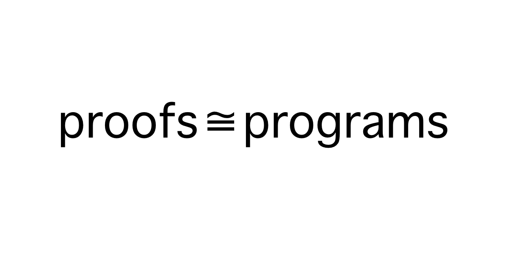
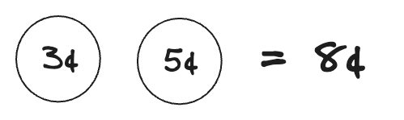

Proofs are programs, and programs are proofs. That's basically what the [Curry-Howard correspondance](https://en.wikipedia.org/wiki/Curry%E2%80%93Howard_correspondence) says.

Proofs can be transformed in programs, and programs can be transformed into proofs. If you have a proof, you can get a program out of it for free. If you have the right kind of program, it also serves as a proof. As a category theorist might say, *proofs are isomorphic to programs*.

> Proofs $\cong$ Programs 

## Direct Proofs and Functions

While learning about direct proofs in math, it helped me to think of a direct proof as a simple function that I was trying to write. For example, let's say we need to prove the following:

if $a$ and $b$ are odd numbers, then $a + b$ is even

Using the method of direct proof, we need to show how adding any two odd numbers together results in an even number.

We can think of this proof like a little function we are trying to write:

```ts
function addOdds(a: OddNumber, b: OddNumber): EvenNumber {
  // TODO: Fill this in with some stuff that
  // takes two odd numbers, adds them together
  // and returns the result as an even number
}
```

Using algebra, we could "fill in" this "function" like so:

We know that by the definition of an odd number, any odd number can represented by $2n + 1$ where $n$ is any integer. So let's take two odd numbers and add them together.

$$
(2x + 1) + (2y + 1)
$$

Using some algebraic steps we can manipulate these numbers to show that this results in an even number. By definition, an even number can be shown as $2n$ where $n$ is any integer. So let's try to rearrange what we've got to give us something in the form of $2n$, which we know is an even number. 


$$
(2x + 1) + (2y + 1)
\\= 2x + 2y + 2
\\= 2(x + y + 1)
$$

Now we know that $x$, $y$ and $1$ are integers, and we know that the sum of any integers is an integer. So we could call the sum of these integers $n$, an integer. $x + y + 1 = n$

Therefore we have our even number! Let's look at the whole process.

$$
a + b
\\= (2x + 1) + (2y + 1)
\\= 2x + 2y + 2
\\= 2(x + y + 1)
\\= 2n
$$

Just as if we were writing a function, we took an input (in this case two odd numbers) and we "proved" that we could add these together and output an even number. The whole process felt a lot like trying to write a function that took an input and trying to manipulate the value(s) to match the return type of the function.

In fact, here's what the process could look like if we did it all in TypeScript.

```ts
type Integer = number;

// odd number is defined as 2x + 1
//  where x is an Integer
type OddNumber = {
  coefficient: 2,
  term: Integer,
  constant: 1,
}

// even number is defined as 2x
//  where x is an Integer
type EvenNumber = {
  coefficient: 2,
  term: Integer,
  constant: 0,
}

function addOdds(a: OddNumber, b: OddNumber): EvenNumber {
  // a + b
  // where a and b are odd numbers
  // = (2x + 1) + (2y + 1)
  // = 2x + 2x + 2
  // = 2(x + y + 1)

  // calculate (x + y + 1)
  const n = (a.term + b.term + 1) as Integer;
  // we get an integer n
  // we can put this in the form 2n to get an even number
  return {
    coefficient: 2,
    term: n,
    constant: 0,
  };
}
```

[Try it on the TS Playground](https://www.typescriptlang.org/play/?#code/C4TwDgpgBAkgdsCBzCAnKBeKcCuBbAIzQG4AoUgegqgHsATO7fI9ASwGco6IAzVuCIwCGnAEwAPKAGooARkrUoAdwAWaaJI5QhcWAmRpSoSFADyDAHLM0mKAG9SUKAGMavPs9YQEALiiiAGkcoRFQ8P3hEFFQgp1c4dmAdYD9ZIIBfciooCAA3byZCGy1uPgFhMXEFJ1V1KE1OHT0ow2NoAFF8uCsi9CwHOLceDy9ff1iQtHDmgxjg+MTkvwAGDPIeHDhnYFYaXSEGczp2AAohPyOelgCoAgvLa1QASj9O7yubAahsoWlb4OytVQ0F+OkYBG0wNoDEKLHYAOoWBOEj+sief2RIFRTwRthRMnx-lxWFEJ0kMixMjR5Cc2WcQgANs4cAyhIgoGS-pS5DjBglgNhbGcAHShPB-AiiqbY7ScSKzMi06hKaAoAVNfgtdBwXEqlxNMA4AXAFRafghNRQHg0ML+XTAGhQNXaXR5Aq4XrBYHAHCoXRfQbuViebwpcbBJxivxwCZ8xZjVbBdJkTLVAAqACUAJpQACCABF8zALABxMyFqAWACqAFkAELtDMAZSgAAlG+1SAsaAyIMKGTQkGdDgx2AB1VBCMCQVAnADMNwArE8nmQstQJ1OZ1bNttdvbHTh2NAwKzzR64aQNlsdnttCPjpvp2gztHHjc7rC0C8v+gvte9zvPAhAAawgS5HhOOA316H8IN6ewIygVgeA5XQAFJ-CgABCDAsDRRCnCIi1UBoJRsAgcj2lQUjZwAInoRgLxsYEAEccFYYE6Do1ckMyYjvV9f0kMDYZg1GMNAhEyYwj8Gs2RUYUeAHG0oO+fx0REGZoljIiFiSMY0j4xUoH4ncb33HJckZD5Z2gswHgQgAfKA3m6R4f2Yv8kMEv00OFVwgxDBAoAAKmwKUwnRGQ4ACvZ42AEyzK9CAfT8vIbMgg46COU5gLA+CWDOJ4bny8DHKKggV141MgA)

Here we did the exact same thing as we did in the proof, just translated to TypeScript. And just like that, we have a working program that will add up any two odd numbers and give us an even number.

## Inductive Proofs and Recursive Functions

There's a more striking relationship between proofs and programs when we start looking at math proofs using induction. These work exactly like recursive functions, as pointed out in [HTDP](https://htdp.org/2023-8-14/Book/part_two.html#%28part._ch~3adesign-lists%29).

In particular let's think about inductive proofs where we have something like, "For all integers $n \geq a$, a property $P(n)$ is true."

The underlying logic is the same as writing a basic recursive function for an input that is above some value.

<table>
<thead>
  <tr>
    <th>Induction Proof</th>
    <th>Recursive Function</th>
  </tr>
</thead>
<tbody>
  <tr>
    <td>Prove $P(a)$ </td>
    <td>Define the base case for a value $a$</td>
  </tr>
  <tr>
    <td>Assume $P(k)$ is true if $k$ is any value $\geq a$. This is called the "inductive hypothesis."</td>
    <td>Use the function `f(k)` recursively, assuming it works with any value $k$ which is $\geq a$. This is called the recursive "leap of faith."</td>
  </tr>
  <tr>
    <td>Show that if $P(k)$ is true, then $P(k+1)$ is also true </td>
    <td>Given any input greater than $a$, the base case, write the code to show how you can combine the value of `f(k)` with something else to produce a proper result for `f(k+1)`</td>
  </tr>
</tbody>
</table>

For example, let's look at a very simple recursive function for computing the length of an array:

```ts
function arrayLength<T>(arr: T[]): number {
  // define the base case for an empty array
  if (arr.length === 0) {
    return 0;
  }
  const k = arr.slice(1);
  // Here we use the function recursively, assuming that it works
  // and show how we can calculate the length of something "one bigger"
  // This is the "LEAP OF FAITH" or "INDUCTIVE HYPOTHOSIS"
  return arrayLength(k) + 1;
}
```

No matter how big of an array we put into this function, it will always return the correct length. (Assuming we don't exceed maximum recursion depth and blow out the stack. 😬)

## Turning a proof into a program

Now let's look at something more interesting. Earlier we said that proofs are programs. Let's take an interesting proof using induction and see how it translates directly into a recursive program!

In Sussana S. Epp's [Discrete Mathematics with Applications](https://www.amazon.com/Discrete-Mathematics-Applications-Susanna-Epp/dp/0495391328) she gives the example of a simple but interesting proof using induction. She explained how some people argue that without a pennies (1¢ coins), there would be lots of values that you wouldn't be able to pay for. But actually, if you had only 3¢ and 5¢ coins, you could pay for _any_ value greater than 7¢. Or, to state it a bit more formally:

> "For any value _n_ equal to or above 8¢, _n_ cents can be obtained using 3¢ and 5¢ coins."

To prove this, we can use the method of proof by induction.

1. Show that it's true with the base value: 8¢
2. Assume that this will work for any value $\geq$ 8¢
3. Show how it will work for any value $\geq$ 8¢ $+$ 1¢

**First**, we need to prove that this is true **for the base value**: 8¢.



Done. $3¢ + 5¢ = 8¢$

**Second**, we will blindly _assume_ that we can make change using 3¢ and 5¢ for any value equal to or greater than 8¢. This is the **inductive hypothesis**.

**Third**, using this assumption, we need to show how we can always make change for something 1¢ more.

Given _any_ pile of 3¢ and 5¢ coins valued at least 8¢, we need to show how we can make a value 1¢ more. Well, if we have a pile like that there are two options:

1. If there's a 5¢ coin in the pile we can replace it with two 3¢ coins. This gives us 1¢ more.
2. If there's no 5¢ coin in the pile, than there _must_ be at least three 3¢ coins, because we know that the value has to be at least 8¢. We can replace those three 3¢ coins with two 5¢ coins. This gives us 1¢ more.

And there, using the magic of mathematical induction, we've proven that we can make change for any value of at least 8¢ using only 3¢ and 5¢ coins!

But that's not all, **because we have the proof, we automatically have a program that will make this change for us**!

All we need to do is translate the exact same logic into a language that a computer can run. Let's use TypeScript.

```ts
// Let's make a type Coin which is either a 3¢ or 5¢ coin.
type Coin = 3 | 5;

// and a function that takes an amount of at least 8¢ and returns
// the change, an array of 3¢ and 5¢ coins
function makeChange(amount: number): Coin[] {
  // ensure we don't use an amount less than 8¢
  if (amount < 8) {
    throw new Error("Amount must be at least 8¢");
  }
  // ... 
}
```

Following the inductive logic above, the first thing we need to do is define the base case for our recursive function. This is the same thing as proving the statement with the base value.

```ts
type Coin = 3 | 5;

function makeChange(amount: number): Coin[] {
  if (amount < 8) {
    throw new Error("Amount must be at least 8¢");
  }
  // BASE CASE HERE
  if (amount === 8) {
    // give back a 5¢ and 3¢ coin, which add up to 8¢
    return [5, 3];
  }
  // ...
}
```

From this point on we will just _assume_ that our function will work for any values of at least `8` that we give it. Here we see that the "inductive hypothesis" and the "recursive leap of faith" are the same thing.

Now all we need to do is show that given _any_ pile of change at least 8¢ big, we can make one 1¢ bigger. We'll use the exact same logic as the proof above.

```ts
type Coin = 3 | 5;

function makeChange(cents: number): Coin[] {
  if (cents < 8) {
    throw new Error("ERROR: Amount must be at least 8¢");
  }
  // With the base case of 8¢
  if (cents === 8) {
    // give back a 5¢ and 3¢ coin, which add up to 8¢
    return [5, 3];
  }
  // With any other amount greater than 8¢
  //   we just assume that our makeChange function works for a
  //   pile one cent smaller ("leap of faith")
  const pile = makeChange(cents - 1);
  //   and then we make the pile 1¢ larger
 
  // 1. if the pile has one 5¢ coin
  if (pile.includes(5)) {
    // replace one 5¢ coin with two 3¢ coins
    return replaceCoins(pile, 5, 1, [3, 3]);
  }
  // 2. otherwise the pile must have three 3¢ coins
  // in that case, replace three 3¢ coins with two 5¢ coins
  return replaceCoins(pile, 3, 3, [5, 5]);
}
```

All we have left to do is write that one little helper function `replaceCoins` that takes the pile and replaces our coins for us.

```ts
function replaceCoins(
  coins: Coin[],
  coin: Coin,
  n: number,
  replacement: Coin[],
): Coin[] {
  const pile = [...coins];
  // take out coin n times
  for (let i = 0; i < n; i++) {
    const d = pile.findIndex(x => x === coin);
    pile.splice(d, 1);
  }
  // add the replacement coins to the pile
  return [...pile, ...replacement];
}
```

And voila! Thanks to the Curry-Howard correspondence, we've just translated our proof into a working program! Not only do we know this is possible, we can see exactly how the change is made for any given value.

You can try it below and see that it works for any value of at least `8`.

<iframe src="https://stackblitz.com/edit/vitejs-vite-msuk4v?embed=1&file=src%2Fmake-change.ts"
    style={{ width: "100%", height: "650px", border: 0, borderRadius: "4px", overflow: "hidden" }}
    title="jsx-text-transformation"
    sandbox="allow-forms allow-modals allow-popups allow-presentation allow-same-origin allow-scripts"
></iframe>


