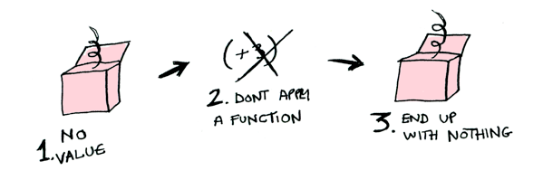
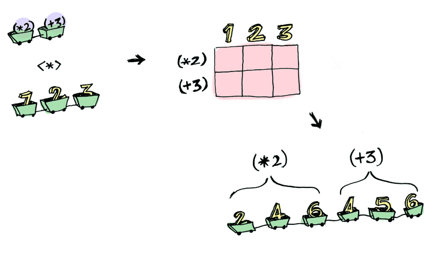
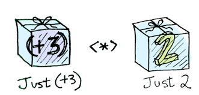
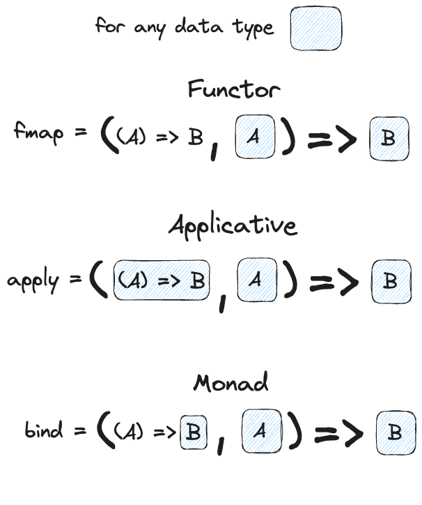
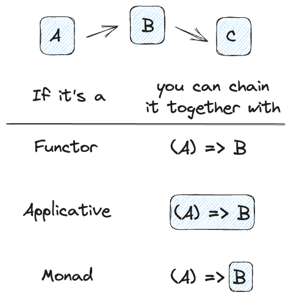

<aside>

> This is a translation of [Functors, Applicatives, And Monads In Pictures](https://www.adit.io/posts/2013-04-17-functors,_applicatives,_and_monads_in_pictures.html) into TypeScript. I've left the Haskell examples for reference and comparison. 
</aside>

Here’s a simple value:


And we know how to apply a function to this value:


```ts
console.log((x => x + 3)(2))
// 5
```

Simple enough. Lets extend this by saying that any value can be in a context. For now you can think of a context as a box that you can put a value in:


Now when you apply a function to this value, you'll get different results **depending on the context**. This is the idea that Functors, Applicatives, Monads, Arrows etc are all based on. The `Maybe` data type defines two related contexts:

In Haskell
```haskell
data Maybe a = Nothing | Just a
```

In TypeScript
```ts
type Nothing = null;
type Just<A> = { just: A };

type Maybe<A> = Nothing | Just<A>; 
```

In a second we'll see how function application is different when something is a `Just<A>` versus a `Nothing`. First let's talk about Functors!

## Functors

When a value is wrapped in a context, you can’t apply a normal function to it:


This is where `fmap` comes in. `fmap` is from the street, `fmap` is hip to contexts. `fmap` knows how to apply functions to values that are wrapped in a context. For example, suppose you want to apply (+3) to Just 2. Use `fmap`:

In Haskell
```haskell
> fmap (+3) (Just 2)
Just 5
```

In TypeScript
```ts
// we need do define fmap for our Maybe type in TypeScript
function fmapMaybe<A, B>(f: (a: A) => B, m: Maybe<A>): Maybe<B> {
  if (!m) {
    return undefined;
  }
  return { just: f(m.just) };
}

console.log(fmapMaybe((x) => x + 3, { just: 2 }))
// { just: 5 }
```


**Bam!** fmap shows us how it's done! But how does fmap know how to apply the function? (In this TypeScript translation, we already had to create our own `fmap` function for `Maybe`)

## Just what is a Functor, really?

Functor is a [typeclass](http://learnyouahaskell.com/types-and-typeclasses#typeclasses-101). Here's the definition:


A `Functor` is any data type that defines how `fmap` applies to it. In TypeScript, *we don't have typeclasses*, so we have to think of a functor as **any data type that we have a `fmap`-like function defined for**.

Here's how fmap works illustrated in Haskell:


and here's the same idea in TypeScript


So we can do this in Haskell:

```haskell
> fmap (+3) (Just 2)
Just 5
```

Or this in TypeScript:

```ts
console.log(fmap(x => x + 3, { just: 2 }));
// { just: 5 }
```

And `fmap` magically applies this function, because `Maybe` is a Functor. It specifies how fmap applies to `Justs` and `Nothings`:

```haskell
instance Functor Maybe where
    fmap func (Just val) = Just (func val)
    fmap func Nothing = Nothing
```

In TypeScript things are *not* quite so magical. We can't just use `fmap` for any type of Functor. (Unless we wanted to make one big `fmap` function and then use type-narrowing for whatever type of Functor we throw at it... but let's not do that.) **If we want a data type to be a Functor, we need to define a `fmap`-like function for it**. Here's our function to make `Maybe` into a Functor: 

```ts
function fmapMaybe<A, B>(f: (a: A) => B, m: Maybe<A>): Maybe<B> {
  // if we have a Nothing, return Nothing
  if (!m) {
    return m;
  }
  // if we have a Just, return a Just with the function
  // applied to the contents 
  return { just: f(m.just) };
}
```

Here's what is happening behind the scenes when we write `fmap (+3) (Just 2)` in Haskell, or `fmapMaybe(x => x + 3, { just: 2 })` in Typescript:


So then you're like, alright `fmapMaybe`, please apply `x => x + 3` to a `Nothing`?



In Haskell
```haskell
> fmap (+3) Nothing
Nothing
```

In TypeScript
```ts
console.log(fmapMaybe(x => x + 3, undefined));
// undefined
```


Like Morpheus in the Matrix, `fmap` knows just what to do; you start with `Nothing`, and you end up with `Nothing`! fmap is zen. Now it makes sense why the `Maybe` data type exists. For example, here's how you work with a database record in a language without `Maybe`:

```
post = Post.find_by_id(1)
if post
  return post.title
else
  return nil
end
```

But in Haskell:

```haskell
fmap (getPostTitle) (findPost 1)
```

Or in TypeScript with our Maybe data type:

```ts
fmapMaybe(getPostTitle, findPost(1));
```

If findPost returns a post, we will get the title with `getPostTitle`. If it returns `Nothing`, we will return `Nothing`! Pretty neat, huh? `<$>` is the infix version of `fmap` in Haskell, so you will often see this instead:

```haskell
getPostTitle <$> (findPost 1)
```

In TypeScript, we can't define infix operators / functions, so no fancy `<$>` for TypeScript ... 😔

Here's another example: what happens when you apply a function to a list?


Lists are functors too! Here's the definition in Haskell:

```haskell
instance Functor [] where
    fmap = map
```

In TypeScript we use `Array` instead of list, and `Array` is a functor because it has a method called `Array.map()` which works as `fmap` for arrays.

```ts
console.log([2,4,6].map((x) => x + 3));
// [5,7,9]
```

Okay, okay, one last example: what happens when you apply a function to another function in Haskell?

```haskell
fmap (+3) (+1)
```

Here's a function:


Here's a function applied to another function:


The result is just another function!

```haskell
> import Control.Applicative
> let foo = fmap (+3) (+2)
> foo 10
15
```

So, in Haskell functions are Functors too!

```haskell
instance Functor ((->) r) where
    fmap f g = f . g
```

When you use fmap on a function, you're just doing function composition!

In TypeScript we have to do a bit more work to make functions composable and fmap-able:

```ts
function compose<A, B, C>(f: (a: A) => B, g: (b: B) => C): (a: A) => C {
  return function(x: A): C {
    return g(f(x));
  }
}

function fmapFunction<A, B, C>(f: (a: A) => B, g: (b: B) => C): (a: A) => C {
  return compose(f, g);
}
```

## Applicatives

Applicatives take it to the next level. With an applicative, our values are wrapped in a context, just like Functors:


But our functions are wrapped in a context too!


Yeah. Let that sink in. Applicatives don't kid around. In Haskell, `Control.Applicative` defines `<*>`, which knows how to apply a function *wrapped in a context* to a value *wrapped in a context*:


i.e: (in Haskell)

```haskell
Just (+3) <*> Just 2 == Just 5
```

In TypeScript we will have to define something like the `<*>` operator (often called `apply`) if we want a data type to be an Applicative.

Let's define an applicative `apply` function for our `Maybe` data type:

```ts
function applyMaybe<A, B>(f: Maybe<(a: A) => B>, m: Maybe<A>): Maybe<B> {
  // if the function Maybe is Nothing, return Nothing
  if (f === undefined) {
    return undefined;
  }
  // if the data Maybe is Nothing, return Nothing
  if (m === undefined) {
    return undefined;
  }
  // else apply the function in the Maybe
  // to the data in the Maybe
  return { just: f.just(m.just) };
}

console.log(applyMaybe({ just: x => x + 3 }, { just: 2 }));
// { just: 5 }
```

Using `<*>` in Haskell can lead to some interesting situations. For example:

```haskell
> [(*2), (+3)] <*> [1, 2, 3]
[2, 4, 6, 4, 5, 6]
```




Here we applied a *list of functions* to a *list of values*. The `<*>` function then takes each of the functions in the list and applies them to all the values in the other list.

In TypeScript, we would have to define an `apply` function for the `Array` data type to make it an Applicative:

```ts
function applyArray<A, B>(fa: ((a: A) => B)[], arr: A[]): B[] {
  // apply each function in the array
  // to each element in the other array
  return fa.flatMap(f => arr.map(f));
}

console.log(applyArray(
  [
    x => x * 2,
    x => x + 3,
  ],
  [1, 2, 3],
));
// [2,4,6,4,5,6]
```

Here's something you can do with Applicatives that you can't do with Functors. How do you apply a function that takes two arguments to two wrapped values?

First let's look at in in Haskell. This may seem very strange, but you can scroll down to our TypeScript <s>imitation</s> translation below...

```haskell
> (+) <$> (Just 5)
Just (+5)
> Just (+5) <$> (Just 4)
ERROR ??? WHAT DOES THIS EVEN MEAN WHY IS THE FUNCTION WRAPPED IN A JUST
```

Applicatives:

```haskell
> (+) <$> (Just 5)
Just (+5)
> Just (+5) <*> (Just 3)
Just 8
```

`Applicative` pushes `Functor` aside. "Big boys can use functions with any number of arguments," it says. "Armed `<$>` and `<*>`, I can take any function that expects any number of unwrapped values. Then I pass it all wrapped values, and I get a wrapped value out! AHAHAHAHAH!"

```ts
> (*) <$> Just 5 <*> Just 3
Just 15
```

And hey! There's a function called liftA2 that does the same thing:

```ts
> liftA2 (*) (Just 5) (Just 3)
Just 15
```

For those not familiar with Haskell, these last examples might seem especially confusing. This works in Haskell because of curried functions, and to imitate this magic in TypeScript, we will have to define our own curried versions of `+` and `*`


```typescript
const add = (a: number) => (b: number) => a + b;
const multiply = (a: number) => (b: number) => a * b;
```

Now that we have curried functions we can do something similar in TypeScript:

```ts
fmapMaybe(add, { just: 5 });
// { just: (b) => a + b }
```

Do you see what happened there? We applied the first argument of the `add` function to the `5` inside the `Maybe`, and now we have **the other half of the add function** in a Maybe. It's like a function that's waiting for us to give a `b` to, and it will give us `5 + b` back.

We can't just throw another `fmap` around it to finish the job:

```ts
const x = fmapMaybe(add, { just: 5 });
fmapMaybe(
  x, // TypeError: x is not a function
  { just: 3 },
)
```

This doesn't work because we're not giving `fmap` a function like it asks for. We're giving it **a function wrapped in a `Maybe`**. How can we apply a function wrapped in a `Maybe` ?? That's exactly what `applyMaybe` is for!

```ts
const x = fmapMaybe(add, { just: 5 });
// x = { just: (b) => a + b }
applyMaybe(x, { just: 3 });
// { just: 8 }
```

Here's another example of the same thing with our curried `multiply` function:

```ts
applyMaybe(
  fmapMaybe(multiply, { just: 5 }),
  { just: 3 }
)
// { just: 15 }
```

Haskell has `liftA2` to do the same thing, so let's define that for our `Maybe` type in TypeScript.

```ts
function liftA2Maybe<A, B, C>(
  f: (a: A) => (b: B) => C,
  a: Maybe<A>,
  b: Maybe<B>
): Maybe<C> {
  return applyMaybe(fmapMaybe(f, a), b);
}

liftA2Maybe(add, { just: 2 }, { just: 3 });
// 5
liftA2Maybe(multiply, { just: 10 }, { just: 3 });
// 30
```

In Haskell, the Applicative typeclass also defines a function `pure` which takes a value and wraps in it the data type, so for completeness, we can also define a function `pureMaybe` to make our `Maybe` data type into a real Applicative.

```typescript
function pureMaybe<A>(a: A): Maybe<A> {
  return { just: A };
}
```

## Monads

How to learn about Monads:

1. Get a PhD in computer science.
2. Throw it away because you don't need it for this section!

Monads add a new twist.

Functors apply a function to a wrapped value:


Applicatives apply a wrapped function to a wrapped value:



Monads apply a function **that returns a wrapped value** to a wrapped value. Monads in Haskell have a function `>>=` (pronounced "bind") to do this.

Let's see an example. Good ol' `Maybe` is a monad:


Suppose `half` is a function that only works on even numbers:

In Haskell:

```haskell
half x = if even x
           then Just (x `div` 2)
           else Nothing
```

In TypeScript:

```ts
function isEven(n: number): boolean {
  return n % 2 === 0;
}

function half(n: number): Maybe<number> {
  if (isEven) {
    return { just: n / 2 };
  } else {
    return undefined;
  }
}
```


What if we feed it a wrapped value?


In Haskell we need to use `>>=` (bind) to shove our wrapped value into the function. Here's a photo of `>>=`:


Here's how it works in Haskell:

```haskell
> Just 3 >>= half
Nothing
> Just 4 >>= half
Just 2
> Nothing >>= half
Nothing
```

What's happening inside? `Monad` is another typeclass. Here's a partial definition:

```haskell
class Monad m where
    (>>=) :: m a -> (a -> m b) -> m b
```

Where `>>=` is:


So `Maybe` is a Monad:

```haskell
instance Monad Maybe where
    Nothing >>= func = Nothing
    Just val >>= func  = func val
```

Let's define a `bindMaybe` function for our `Maybe` type in TypeScript, so that `Maybe` can be a Monad in TypeScript too!

```ts
function bindMaybe<A, B>(f: (a: A) => Maybe<B>, a: Maybe<A>): Maybe<B> {
  // if there is no value in Maybe, return Nothing
  if (!a) {
    return undefined;
  }
  // 🪠 unwrap the value in Maybe
  const val = a.just;
  // apply the function to the value
  return f(val);
}
```

Here it is in action with a `Just 3`!


And if you pass in a `Nothing` it's even simpler:


You can also chain these calls:

In Haskell:

```haskell
> Just 20 >>= half >>= half >>= half
Nothing
```

In TypeScript:

```ts
bindMaybe(
  half,
  bindMaybe(half, 
    bindMaybe(half, { just: 20 })
  )
);
// undefined
```


Cool stuff! So now we know that `Maybe` is a `Functor`, an `Applicative`, and a `Monad`.

Just for completeness, we should also mention that Monads are defined with another function called `return` which takes a plain value and returns it wrapped in the data type of our Monad. This is the same thing as `pure` in the Applicative.

```ts
function returnMaybe<A>(a: A): Maybe<A> {
  return { just: A };
}
```

Now let's mosey on over to another example in Haskell: the `IO` monad:


Specifically three functions. `getLine` takes no arguments and gets user input:


```haskell
getLine :: IO String
```

`readFile` takes a string (a filename) and returns that file's contents:


```haskell
readFile :: FilePath -> IO String
```

`putStrLn` takes a string and prints it:


All three functions take a regular value (or no value) and return a wrapped value. We can chain all of these using `>>=` (bind)!


```ts
getLine >>= readFile >>= putStrLn
```

Aw yeah! Front row seats to the monad show!

So what's the gooey green wrapping in all of this? You can think of it as all the slimy side effects and execution going on in our machine. The values that we want are passed along in this slimy green wrapper, and if at one point in the execution something fails, it just bubbles up an error.

Haskell also provides us with some syntactical sugar for monads, called `do` notation:

```haskell
foo = do
    filename <- getLine
    contents <- readFile filename
    putStrLn contents
```

As Joel Kaasinen and John Lång pointed out [in this excellent Haskell MOOC](https://haskell.mooc.fi/part2#monads-in-other-languages), JavaScript / TypeScript does something very similar with Promises, although there is [much](https://hackernoon.com/functional-javascript-functors-monads-and-promises-679ce2ab8abe) [disagreement](https://stackoverflow.com/questions/45712106/why-are-promises-monads) about whether they are really monads.

`Promise.then` works a lot like `>>=` (bind).

```ts
import prompt from "prompt-async";
import fs from "fs";

prompt.get(["filename"]).then(filename => {
  fs.promises.readFile(filename).then(contents => {
    console.log(contents);
  })
});
```

Just like the `bind` or `>>=` function, the `Promise.then()` method take a function that takes a plain value and returns another value wrapped in a `Promise`. (You can also return a plain value though.)

And the `async` notation used for promises also looks and works just like the `do` notation for monads in Haskell!

```ts
async function printFile() {
  const filename = await prompt.get(["filename"]);
  const contents = await fs.promises.readFile(filename);
  console.log(contents);
}
```

## Conclusion

In Haskell:

1. A functor is a data type that implements the `Functor` typeclass.
2. An applicative is a data type that implements the `Applicative` typeclass.
3. A monad is a data type that implements the `Monad` typeclass.
4. A `Maybe` implements all three, so it is a functor, an applicative, *and* a monad.

Or in TypeScript for our purposes...

1. A function is a data type that has an `fmap` function defined for it.
2. An applicative is a data type that have `apply` and `pure` functions defined for it.
3. A monad is a data type that has `bind` and `return` functions defined for it.
4. Our `Maybe` data type implements all three, so it is a functor, an applicative, *and* a monad.

What is the difference between the three?


functors: you apply a function to a wrapped value using `fmap` or `<$>`  
applicatives: you apply a wrapped function to a wrapped value using `<*>` or `liftA`  
monads: you apply a function that returns a wrapped value, to a wrapped value using `>>=` or `lift`  

Here's a visual recap of the general concepts in TypeScript style:



Notice how the only thing that changes in all three is the function passed in on the left? So we can see that these are *all different ways of getting from a wrapped `A` to a wrapped `B`*.



So, dear friend (I think we are friends by this point), I think we both agree that monads are easy and a SMART IDEA(tm). Now that you've wet your whistle on this guide, why not pull a Mel Gibson and grab the whole bottle. Check out LYAH's [section on Monads](http://learnyouahaskell.com/a-fistful-of-monads). There's a lot of things I've glossed over because Miran does a great job going in-depth with this stuff.

Here's a sandbox with our `Maybe` (functor/applicative/monad) defined below:

<iframe src="https://stackblitz.com/edit/typescript-tvpp4i?embed=1&file=index.ts&view=editor"
    style={{ width: "100%", height: "650px", border: 0, borderRadius: "4px", overflow: "hidden" }}
    title="jsx-text-transformation"
    sandbox="allow-forms allow-modals allow-popups allow-presentation allow-same-origin allow-scripts"
></iframe>

<hr />

This has been a translation and adaptation of of [Functors, Applicatives, And Monads In Pictures](https://www.adit.io/posts/2013-04-17-functors,_applicatives,_and_monads_in_pictures.html) by [Adit](https://www.adit.io/index.html) into TypeScript. 


