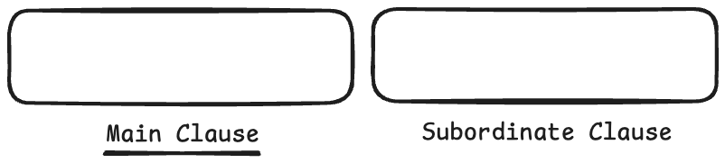
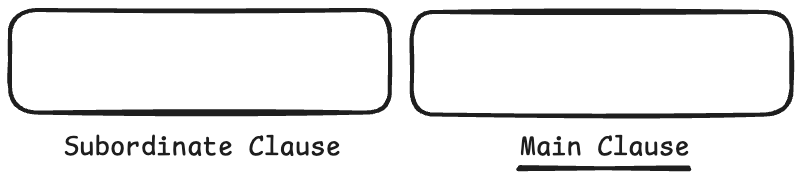
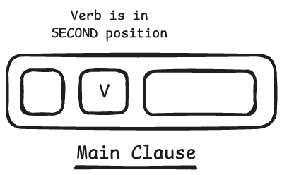
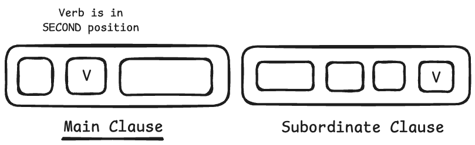
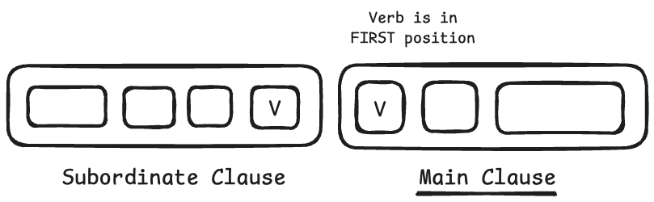

We often hear that German verbs go in the "second position" in phrase.

> Ich **lerne** Deutsch.

As every grammar books says, in the main clause of statements, the verb goes in second position.

> Ich **lerne** Deutsch *(main clause)*, weil ich nach Deutschland ziehe. *(subordinate clause)*

## The Question / Problem 🤷‍♂️

But we often see verbs at the *beginning* of phrases. They often come **in first position**, and not in second position.

> Weil ich arbeite, **stehe** ich frühe auf.

Of course this happens with question or command clauses. But I'm not talking about interogative or imperative clauses. **I'm talking about statement clauses**. Sometimes the verb *does* go in first position, even with declarative sentences. Why? When??

I haven't seen an explanation in grammar books. Other people have asked about this online, but I haven't seen an explanation. Even ChatGPT was powerless and confused. Everyone seems to ignore this reality and says things like, "German puts the verb in 1st position with question phrases." No, we're asking about statement clauses. People need to know... **Why does the verb sometimes go in first position?** Why does it do this?! When!?

Thankfully there *is* a clear explanation and a simple rule. 

**It depends on the ordering of the clauses**.

You see, there are two ways we can order the clauses in sentences.

### Order #1 - Main clause, then subordinate clause

We can put the main clause first, and then the subordinate clause after.

Examples:

Ich lerne Deutsch (main clause), weil ich nach Deutschland ziehe (subordinate clause)  
*I am learning German, (main clause) because I am moving to Germary. (subordinate clause)*

Ich habe Deutsch als Hobby gelernt (main clause), bis vor kurzem. (subordinate clause)  
*I learned German as a hobby (main clause), until recently. (subordinate clause)*

**In these cases, the verb of the main clause is in SECOND position.**

### Order #2 - Subordinate clause, then main clause

But we can also put the subordinate clause *before* the main clause

Examples:

Weil ich nach Deutschland ziehe (subordinate clause), lerne ich Deutsch. (main clause)   
*Because I'm moving to Germany, (subordinate clause), I am learning German, (main clause)*  

Bis vor kurzem (subordinate clause), habe ich Deutsch als Hobby gelernt. (main clause)  
*Until recently, (subordinate clause), I learned German as a hobby. (main clause)*

**In these cases, the verb of the main clause is in FIRST position, not second.**

## The Answer / Rule 👨‍⚖️

When we are talking about statement clauses...

> **When there is no subordinate clause**, the verb goes in **second position**.

> **When the main clause comes before** a subordinate clause, the verb of the main clause goes in **second position**

> **When the main clause comes after** the subordinate clause, the verb of the main clause goes in the **first position**

And of course, the verb in the subordinate clause always goes in the last position.
