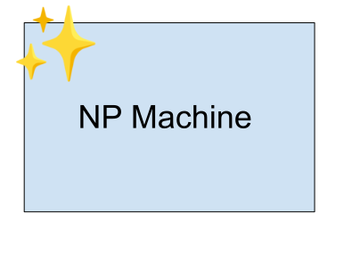

import OldVerbExplorer from "./old-verb-explorer/OldVerbExplorer";
import lingTree from "./ling-tree-ex.svg";
import lispTree from "./lisp-tree-ex.svg";
import threePlusFour from "./three-plus-four.svg";
import sevenTimesThree from "./seven-times-three.svg";
import fourteen from "./fourteen.svg";
import mathSyntaxTree from "./math-syntax-tree.svg";
import mathSyntaxTree2 from "./math-syntax-2.svg";
import mathSyntaxTree3 from "./math-syntax-3.svg";
import mathSyntaxTree4 from "./math-syntax-4.svg";
import machineLisp from "./eval-lisp-tree.svg";
import machineLing from "./eval-ling-tree.svg";
import PhraseBuilder from "./new-verb-explorer/PhraseBuilder";
import NPBuilder from "./new-verb-explorer/NPBuilder";
import {
    defaultTextOptions,
} from "@lingdocs/ps-react";

Peter Naur talked about [programming as theory building](https://pages.cs.wisc.edu/~remzi/Naur.pdf), and argued that programming is: *"an activity by which programmers form or achieve a certain kind of insight, a theory, of the matters at hand."*

**When we write a program about something we are developing, testing, and improving a theory about how that thing works.** The program we build gives us a better understanding of the problem, which leads us to improve the program, and on and on as our theory improves.


I've seen this process at work as I've been working at learning Pashto grammar and building a program that models the inflections, conjugations, and phrase structure of Pashto natural language. **The process of programming a Pashto grammar engine has helped me build a theory of Pashto grammar.**


## The challenge of modelling a Pashto grammar

Pashto has a reputation for being difficult. As [the linguist John McWhorter says](https://lexiconvalley.substack.com/p/lexicon-valley-what-do-they-speak):

> "Persian, real easy. But Pashto, just insurmountable ... it's like it's trying to be hard."

While many other languages, like English, have been simplified over time, **Pashto retains a lot of beautiful complexity**. Pashto has [grammatical gender](https://grammar.lingdocs.com/nouns/nouns-gender/), [inflections](https://grammar.lingdocs.com/inflection/inflection-patterns/), [aspect divisions](https://grammar.lingdocs.com/verbs/verb-aspect/), [split-ergativity](https://grammar.lingdocs.com/phrase-structure/vp/), [interesting types of compound verbs](https://grammar.lingdocs.com/compound-verbs/intro/) and an amazing way of [shortening phrases with enclitic pronouns](https://grammar.lingdocs.com/phrase-structure/vp/), and lots more. 

Unfortunately there are not a lot of resources to help people understand the intricacies of these features in Pashto, so many people just throw up their hands and say the language is difficult or illogical. I've had a lot of fun learning this language and its grammar, and I've been amazed to see **a beautiful, simple, and clear structure** hiding in the mountains of seemingly daunting complexity.

Over the last few years I've been fascinated with trying to understand how this language works, and I've also been working on [a program](https://github.com/lingdocs/pashto-inflector) that can generate Pashto phrases, correctly following all of the complex rules of this language. **The process of writing this phrase-generation program actually helped me understand how the language works, and what its rules are**. This post tells the story of that journey. The process of building this tool has been a lot of fun, and it's also shown me how this beautiful, intricate, and often misunderstood language works. I hope it can help others in understanding it as well.

## Where the idea came from

Years back, I began writing an earlier version of [this Pashto grammar](https://grammar.lingdocs.com) while I was also trying to understand how the grammar of Pashto works myself. It started as a sort of open personal notebook. (My apologies to anyone who read the early version!)

I wanted to make little interactive examples where people could see the different conjugations of verbs.

<div className="mb-4">
<OldVerbExplorer />
</div>

I thought I created a pretty clever little system where I could substitute different verbs and nouns in the chart and it would fill in all the conjugations automatically substitute the right words in the text (using a sort of custom string templating engine in a React component.)

But things got more and more difficult when I wanted to include examples with variable tenses. Pashto is very complex and to make proper phrases you can't just throw the words together like you can often do in English or other languages. Words needs to inflect, certain words need to move around, and it all seemed too complicated to program. My code for generating phrases was *not* robust or flexible enough. My (untyped, spaghetti) code kept spiralling out of control and I was realizing more and more mistakes in the example phrases I was trying to generate.

Turns out string templating was not a good idea for modelling language! I needed a new way of thinking about and tackling the problem, some kind of [domain specific language](https://en.wikipedia.org/wiki/Domain-specific_language) to be able to handle the logic of Pashto sentences.

I had grand ambitions for an interactive, playground-style documentation of Pashto grammar, but I was stuck without the ability to build a robust phrase generator. **How could I teach the computer to generate proper phrases with whatever content (whichever subjects, objects, verbs, tenses) we give it**? 

## Syntax Trees to the Rescue

While that idea for a grammar with interactive phrase examples were on pause, I was also learning about two things around the same time:

1. **In programming**: LISP-style functional programming through [SICP](https://www.youtube.com/watch?v=-J_xL4IGhJA&list=PLE18841CABEA24090&ab_channel=MITOpenCourseWare) and [HTDP](https://htdp.org/)
2. **In linguistics**: [Generative Grammar](https://en.wikipedia.org/wiki/Generative_grammar)

I was amazed to see that **in both of these fields** they used something called **syntax trees** that looked identical!

<table>
    <tbody>
        <tr>
            <th>LISP</th>
            <th>Generative Grammar</th>
        </tr>
        <tr>
            <td>
                
            </td>
            <td>
                
            </td>
        </tr>
        <tr>
        </tr>
    </tbody>
</table>

These trees can also be written with parentheses, like this with LISP:

```lisp
(+ (* 3 4) (+ 1 (* 2 10))
```

Or like this with generative grammar:

[<sub>S</sub> [<sub>NP</sub> [<sub>DT</sub> The] [<sub>NN</sub> man]] [<sub>VP</sub> [<sub>VB</sub> saw] [<sub>NP</sub> [<sub>DT</sub> the] [<sub>NN</sub> food]]]]

The content is different, but the structure is the same.


While working through [HTDP](https://htdp.org/) I learned programming patterns that could be used to read and evaluate syntax trees with programming instructions. I got excited thinking of how **I could use *the same programming patterns* to produce correct phrases and sentences from syntax trees in Pashto**.

First let me explain a bit about how computers can work with these syntax trees, and then later I'll show you how I figured out that *these same processes* can be used to generate phrases in Pashto. If you're already familiar with syntax-trees and recursive processing, you can [skip to the Pashto application part](#pashto-phrase-generation-application). If you don't know much about programming, don't worry, I'll try to explain this as simply as possible.

## Syntax trees in a simple programming language

Let's **imagine we have a very basic computer language that can only add and multiply numbers**. We'll call it *"Lil'MathLang."* 

We feed our *Lil'MathLang* instructions by giving it little syntax trees like this:

<div style={{ maxWidth: "12rem", margin: "0 auto" }}>
    
</div>

This means $3 + 4$, which evaluates to $7$.

Or like this:

<div style={{ maxWidth: "12rem", margin: "0 auto" }}>
    
</div>

This means $7 * 3$, which evaluates to $21$.

Or this:

<div style={{ maxWidth: "12rem", margin: "0 auto" }}>
    
</div>

This means $14$, which evaluates to ... $14$.

We can join these trees together to make more complicated expressions:

<div style={{ maxWidth: "16rem", margin: "0 auto" }}>
    
</div>

$$
4 + ((3 + 1) * 2)
$$

Just like we did in math class, we can go through the tree in little bits and *evaluate* the whole thing to see what the expression means. First we add up 3 + 1 and find that that section evaluates to 4.

<div style={{ maxWidth: "16rem", margin: "0 auto" }}>
    
</div>

$$
4 + (4 * 2)
$$

Now we have a smaller tree and we multiply 4 * 2, which ends up being 8

<div style={{ maxWidth: "14rem", margin: "0 auto" }}>
    
</div>


$$
4 + 8
$$

And now we add 4 + 8, which gives us 12.

<div style={{ maxWidth: "16rem", margin: "0 auto" }}>
    
</div>

$$
12
$$

At the end we have a number, and we are done.

Notice how these definitions refer back to each other and themselves. In other words, they are *recursive*. Because of this you can make these expressions infinitely bigger and bigger. An expression can be a sum of expressions, which are sums and products of expressions, which are products and sums of expressions which are... and so on and so on...

```
(((3 * (7 + 1)) + (3 + (10 * (1 + 8)) * (8 + 10)) + 3)
```

No matter how huge the expressions get, they *always* follow that really simple grammar above.

Here are a few more examples of trees that follow this grammar:

<div id="example-lisp-trees" />


<details>
<summary>If we wrote these trees in TypeScript...</summary>

```ts
const exprA: Expression = {
    operation: "+",
    left: 8,
    right: {
        operation: "*",
        left: {
            operation: "*",
            left: 2,
            right: 5,
        },
        right: 3,
    },
};

const exprB: Expression = {
    operation: "*",
    left: 3,
    right: 9,
};

const exprC: Expression = 5;

const exprD: Expression = {
    operation: "*",
    left: {
        operation: "+",
        left: 2,
        right: 3,
    },
    right: {
        operation: "+",
        left: 1,
        right: 6,
    },
};
```

</details>

#### Step 2: Write instructions to process the trees

Following this grammar, we can write a very simple program that will process any tree that we throw at it. What we do is give the computer a set of "how-to" instructions to deal with the different parts of an expression. In programming we can call these "how-to" instructions *functions*.

The program starts at the top of the tree and keeps looking down *recursively*, adding and multiplying the different sides, until it's evaluated everything down to the bottom.

```
How to get the value of an expression:
    Is it a number ?
        ok, that's it, we're done
    Is it a + ? 
        Add the +
    Is it a * ?
        Multiply the *

How to Add a +:
    Get the value of the left expression
    Get the value of the right expression
    Add them together

How to Multiply a *:
    Get the value of the left expression
    Get the value of the right expression
    Multiply them together
```

<details>
<summary>If we wrote this program in TypeScript...</summary>

```ts
function getValue(expr: Expression): number {
    if (typeof expr is "number") {
        return expr;
    }
    if (expr.operation === "*") {
        return multiply(expr);
    }
    if (expr.operation === "+") {
        return add(expr);
    }
}

function multiply(expr: Product): number {
    return getValue(expr.left) * getValue(expr.right);
}

function add(expr: Sum): number {
    return getValue(expr.left) + getValue(expr.right);
}
```

</details>

Just like the definitions in the grammar reference each other recursively, the functions call each other recursively, until we return a number at the end.

Try taking the trees in the [examples above](#example-lisp-trees) and **follow the instructions exactly** to find out the value of each of the trees/expressions.

Now we have a program that will take *any* syntax tree in *Lil'MathLang* and it will evaluate the value of that tree.

<figure>
<div style={{ maxWidth: "25rem", margin: "0 auto" }}>
    
</div>
    <figcaption>An evaluation program for 'LilMathLang</figcaption>
</figure>

<div id="pashto-phrase-generation-application" />

## Syntax trees in Pashto

Could we do the same thing to teach a computer to process Pashto grammatical phrases as syntax trees?

<div style={{ maxWidth: "25rem", margin: "0 auto" }}>
    
</div>

Just like we wrote a program to evaluate a tree full of multiplication and addition operations like we did above, could we **take a syntax tree of nouns, adverbs, and a verb**, and write a program that would give us a phrase with all the words lined up with their correct inflection and verb conjugation?

**Yes we can!** And the process is exactly the same as for building our program to process trees in our little math language above.

### Writing a program to build phrases out of syntax trees

Just like with our *Lil'MathLang* above, the process basically has two steps:

1. Write a grammar of how syntax trees are built in Pashto.
2. Write instructions for inflecting the words and compiling the syntax trees into grammatically correct Pashto.

#### Step 1: Write a grammar of the syntax trees

Obviously Pashto is more complicated than our *Lil'MathLang* we saw earlier, so we will need a more complex grammar. Also, I wasn't even totally sure how all the different parts of Pashto fit together in syntax trees, so I **started by thinking about one small part** of the language.

I started by sketching out the definitions [noun phrases](https://en.wikipedia.org/wiki/Noun_phrase) in Pashto.

```
An NP (Noun Phrase) in Pashto is one of the following:
 - a Noun
 - a Pronoun
 - a Participle

A Noun is:
  a noun word
    that can have adjectives
    that can have an NP as a possessor

A Pronoun is:
  a pronoun

A Participle is:
  a verb in the infinitive form
    that can have an NP as subject/object
```

<details>
<summary>In TypeScript...</summary>

```ts
type NP = Noun | Pronoun | Participle;

type Noun = {
    type: "noun",
    word: NounWord,
    plural: boolean,
    adjectives: Adjective[],
    possessor?: NP,
};

type Pronoun = {
    type: "pronoun",
    person: number,
    distance: "near" | "far",
};

type Participle = {
    type: "participle",
    word: VerbWord,
    subjObj?: NP,
};
```

</details>

Here are some examples of NPs that follow this grammar. Notice that we're using the *basic*, *uninflected*, *dictionary* forms of the words.

<div id="example-nps" />


<details>
<summary>Example NPs in TypeScript...</summary>

```ts
const exA: NP = {
    type: "noun",
    word: { p: "x̌ədza", e: "woman" },
    plural: false,
    adjectives: [{ p: "zoṛ", e: "old" }],
}

const exB: NP = {
    type: "pronoun",
    person: 5 // denoting 3rd pers sing fem,
    distance: "far",
};

const exC: NP = {
    type: "noun",
    word: { p: "num", e: "name" },
    plural: false,
    adjectives: [],
    possessor: {
        type: "noun",
        word: { p: "saṛai", e: "man" },
        plural: false,
        adjectives: [{ p: "zoṛ", e: "old" }],
    },
};

const exD: NP = {
    type: "participle",
    word: { p: "likəl", e: "to write" },
    subjObj: {
        type: "noun",
        word: { p: "kitāb", e: "book" },
        plural: true,
        adjectives: [],
    },
};
```

</details>

Note that the definitions of NPs are recursive. A noun can have a NP as a possessor, which can have another NP as a possessor, etc. etc. Phrases like "John's friend's father's brother's wife's cousin's ..." can go on *forever*.

So now we have a way to express one little subset of Pashto in syntax trees. But how can we take these syntax trees and teach the computer to turn them into grammatically correct Pashto text?

#### Step 2: Write instructions to process the syntax trees

When putting phrases together in Pashto, we're faced with two big challenges:

1. Inflecting the words and conjugating the verbs
2. Putting the words in the correct order

[HTDP](https://htdp.org) taught me to break up difficult problems into smaller parts, so I decided to break the instructions up into two steps:

1. Go through the tree and **form/inflect** the words according to the phrase structure rules
2. Put the words together in the proper order(s) to make a phrase in text

So far we're only looking at NPs, so let's lay out some instructions for how the words in NPs go through the formation/inflection process.

```
How to form an NP (as inflected or plain):
    Is it a Noun?
        Form the Noun (as inflected or plain)
    Is it a Pronoun?
        Form the Pronoun (as inflected or plain)
    Is it a Participle?
        Form the Participle (as inflected or plain)

How to form a Noun (as inflected or plain):
    Is it plural?
        Inflect the Noun to make it plural
    Is in inflected?
        Inflect the Noun
    Inflect all the adjectives so they agree with the noun
    Does it have a Possessor?
        Form the Possessor NP (as inflected)

How to form a Pronoun (as inflected or plain):
    Is it inflected?
        Inflect the Pronoun

How to form a Participle (as inflected or plain):
    Is it inflected?
        Inflect the Participle
    Does it have a Subject/Object?
        Form the Subject/Object NP (as inflected)

How to inflect a Noun:
    ...
How to inflect an Adjective:
    ...
How to inflect a Participle:
    ...
```

<details>
<summary>In TypeScript...</summary>

```ts
function formNP(np: NP, inflected: boolean): Formed<NP> {
    if (NP.type === "noun") {
        return formNoun(NP, inflected);
    }
    if (NP.type === "pronoun") {
        return formPronoun(NP, inflected);
    }
    if (NP.type === "participle") {
        return formParticiple(NP, inflected);
    }
}

function formNoun(noun: Noun, inflected: boolean): Formed<Noun> {
    return {
        ...noun,
        word: inflect(noun.word, inflected, noun.plural),
        adjectives: noun.adjectives.map((adj) => (
            inflect(adj, inflected, noun.plural)
        )),
        ..."possessor" in noun ? {
            possessor: formNP(noun.possessor, inflected),
        } : {},
    };
}

function formPronoun(pronoun: Pronoun, inflected: boolean): Formed<Pronoun> {
    return {
        ...pronoun,
        word: getPronoun(pronoun.person, inflected),
    };
}

function formParticiple(participle: Participle, inflected: boolean): Formed<Pronoun> {
    return {
        ...participle,
        word: inflect(participle.word, inflected),
        ..."subjObj" in participle ? {
            subjObj: formNP(participle.subjObj, inflected),
        } : {},
    };
}
```
</details>

I've left out the instructions for actually inflecting and making the words plural the words for simplicities sake. In Pashto it's actually *very complicated*, but you can [read about how inflections work here](https://grammar.lingdocs.com/inflection/inflection-patterns/).

Writing out these instructions helped me solidify some rules about what happens with NPs in Pashto:
 - adjectives inflect to agree with the nouns they're attached to
 - possessors are inflected
 - etc.

Let's try taking our [example NPs](#example-nps) and forming the words according to the instructions/functions that we just wrote out.

**Example A.** is a noun "x̌ədza" (woman). So we go to the instructions for forming nouns. We look at the noun and we don't need to inflect it because it's not plural, and it's not an inflected NP. But we need to go through any adjectives attached to the noun and inflect them to match the noun. So the adjective "zoṛ" (old) takes on the feminine inflection "zaṛa." (See [inflection rules](https://grammar.lingdocs.com/inflection/inflection-patterns/#4-words-with-the-pashtoon-pattern))

 

**Example C.** is a noun "num" (name). So we go to the instructions for forming nouns. We look at the noun and we don't need to inflect it because it's not plural, and it's not an inflected NP. There are also no adjectives attached. But we see that it has a possessor, so we process the possessor NP "old man" as an *inflected* NP. (Possessors are inflected in Pashto). This means that we start the whole process again with this possessor NP. (recursion! 🤓)

Moving down the tree we process the NP "old man." It's a noun, so we look at the instructions for forming nouns. It's not plural, but it is inflected, so we need to inflect it to "saṛi." Then we go to process the adjectives. The noun has been inflected so we need to inflect all the adjectives attached. "Zoṛ" (old) inflects to "zaaṛə." There's no possessor and we've reached the bottom of the tree, so we're done.


Then after the formation step, it's not hard to write a second function that takes these trees and writes them out as regular text.


No matter how big or complicated or NPs are, they will all be inflected perfectly *if* our grammar and rules are correct. When we discover the correct rules, it's amazing to see how powerful the underlying structure of the language is. Non-native speakers may stumble over their words or be perplexed by why certain words inflect and how they change in a seemingly illogical and unpredictable way. But once we see the basic set of rules, it all makes sense.

Below is a little playground you can use to create NPs according to the grammar and rules we just spelled out. You can build them from scratch, choose from the examples and modify them, or even get the computer to generate a *totally random* NP. (Note, these random NPs [will be grammatically well-formed, but will often be nonsense](https://en.wikipedia.org/wiki/Colorless_green_ideas_sleep_furiously).)

##### NP Playground

<div className="">
    <NPBuilder opts={defaultTextOptions} />
</div>

#### Expanding the grammar

Now that we have our little NP generation "machine" we can *forget about how it works* and think of it as a black-box machine. For all we care, it just magically takes NP syntax trees and processes them.

<div style={{ maxWidth: "300px", margin: "0 auto" }}>

</div>

I also made another "machine" that takes verbs and gives the correct conjugations. Pashto verbs have [a nice way of conjugating](https://grammar.lingdocs.com/verbs/present-verbs/) verbs by adding endings onto different roots / stems.

<div style={{ maxWidth: "500px", margin: "0 auto" }}>

</div>

Both of these little boxes are pretty complex inside, but we can **forget about how they work**, abstract them into nice little machines and start building more complicated, full phrases with them. Just like mathematicians build rules on top of other rules and engineers build cars by fitting parts together, we can build a more complex grammar engine by fitting these different parts together.

Let's expand our grammar to include phrases with verbs. (I call them VPs, but I am *not* using that term in the same way as people normally in generative grammar! Because I ended up departing from the typical generative grammar framework to make things work better for Pashto.) Here's a really simplified example of how we could define syntax trees with these fuller phrases using what we've built before.

```
A VP (Verb-Based Phrase) is Pashto is one of the following:
 - a VP with an intransitive verb
 - a VP with a transitive verb

A VP with an intransitive verb has:
  a Subject NP
  a Verb
  a tense/aspect choice for the verb

A VP with a transitive verb has:
  a Subject NP
  an Object NP
  a Verb
  a tense/aspect choice for the verb
```

<details>
<summary>In TypeScript...</summary>

```ts
type VP = IntransitiveVP | TransitiveVP;

type IntransitiveVP = {
    word: VerbWord,
    tense: TenseAndAspectInfo,
    subject: NP, 
}

type TransitiveVP = {
    word: VerbWord,
    tense: TenseAndAspectInfo,
    subject: NP,
    object: NP,
}
```
</details>

When we start looking at full phrases we notice that Pashto has a seemingly insane way of using [split-ergativity](https://en.wikipedia.org/wiki/Split_ergativity) and [changing the whole sentence structure](https://grammar.lingdocs.com/phrase-structure/vp/) depending on if the verb is past or present, transitive or intransitive. This is often a huge pitfall for non-native speakers.

###### With intransitive verbs:
 - the verb agrees with the subject
 - the subject does not inflect

###### With non-past transitive verbs:
 - the verb agrees with the subject
 - the subject does not inflect
 - the object does not inflect (except if it's a 1st or 2nd pers pronoun)

###### With past-tense transitive verbs:
 - the verb agrees with the **object**
 - the subject **inflects**
 - the object does not inflect

It took me quite a while to figure out these basic rules by observing the language, asking questions, and looking through books. But once I had those basic rules, it's very straightforward to tell the computer to follow them.

```
How to make a phrase with a verb:
    Is it an intransitive verb ?
        Make a phrase with an intransitive verb
    Is it a transitive verb ?
        Make a phrase with a transitive verb

How to make a phrase with an intransitive verb:
    Make the verb agree with the subject

How to make a phrase with a transitive verb:
    Is it present tense ?
        Is the object a 1st or 2nd person pronoun ?
            Inflect the object NP
        Is the object something else ?
            Don't inflect the object NP
        Conjugate the verb according to the subject
    Is it past tense ?
        Inflect the subject NP
        Conjugate the verb according to the object
```

<details>
<summary>In TypeScript...</summary>

```ts
function formVP(vp: VP): Formed<VP> {
    if (vp.transitivity === "intransitive") {
        formIntransitiveVP(vp);
    }
    if (vp.transitivity === "transitive") {
        formTransitiveVP(vp);
    }
}

function formIntransitiveVP(vp: IntransitiveVP): Formed<IntransitiveVP> {
    const verbPerson = getPersonFromNP(vp.subject);
    return {
        ...vp,
        word: conjugateVerb(vp.word, vp.tense, verbPerson),
        subject: formNP(vp.subject, false),
    },
}

function formTransitiveVP(vp: TransitiveVP): Formed<TransitiveVP> {
    const past = isPastTense(vp.tense);
    const king = past
        ? vp.subject
        : vp.object;
    const inflectSubject = past;
    const inflectObject = !past && isFirstOrSecondPersPronoun(vp.object);
    const verbPerson = getPersonFromNP(king);
    return {
        ...vp,
        word: conjugateVerb(vp.word, vp.tense, verbPerson),
        subject: formNP(vp.subject, inflectSubject),
        object: formNP(vp.subject, inflectObject),
    },
}
```

</details>

All of these instructions, or functions, get glued together and the computer just follows them step by step, until it produces the exact same sentences that a human speaker would produce. 🤯


Once I had these basic phrases working, I could start working on exploring and implementing some more advanced features of the languages. In Pashto, there are is a [really special way of shortening phrases](https://grammar.lingdocs.com/phrase-structure/shortening-vps/), [abbreviating possessors as enclitic pronouns](https://grammar.lingdocs.com/pronouns/pronouns-mini/#2-as-a-shrunken-possesive) and also an interesting behaviour around how enclitic particles [stack up after the first unit or "block" in the phrase](https://grammar.lingdocs.com/phrase-structure/blocks-and-kids/).

To implement these trickier or more unique parts of the grammar I had move beyond the basic tree structures. But I was still able to keep building on the basic blocks we made earlier. As I programmed it I was amazed to discover some **universal rules in the language that were more simple and beautiful than I could have imagined**. 

It was a joy to see that once we get the proper basic blocks of logic, we can glue them all together to make endless combinations of phrases and tenses and forms, and they always come out right! It's just like composing functions or logic propositions in math.

**Here's a demo of the phrase building playground that I dreamed of years ago!** You can try looking at the different example sentences and modify them, or build your own from scratch. You can click on the <i className="fas fa-cubes mx-1" /> above the phrases to see their phrase structure.

<div className="" style={{ marginBottom: "-6rem" }}>
    <PhraseBuilder />
</div>

Demo and instructions here:

<iframe style={{ aspectRatio: "15.6 / 10", width: "100%" }} src="https://www.youtube.com/embed/i3IzRPn4i_w" title="YouTube video player" frameborder="0" allow="accelerometer; clipboard-write; encrypted-media; gyroscope; picture-in-picture; web-share" allowfullscreen></iframe>

### A mathematical model for Pashto phrase generation

So now we have a mathematical function that takes a syntax tree and outputs a grammatically correct Pashto sentence. To adapt a phrase from [Stephen Wolfram](https://writings.stephenwolfram.com/2023/02/what-is-chatgpt-doing-and-why-does-it-work/), this is **a mathematical theory of what humans are doing when they speak Pashto**. With this approach to explicitly spelling out the rules in a phrase generating grammar, we have a clear theory that we can fully examine and prove.


**This is totally different than what we have with AI language models**. With an AI model, like a native speakers brain, you have this giant mesh of neurons that mysteriously processes ideas and spits out language. But you can't reach in and see **why** or **how** they're generating the phrases the way they are. As [Wolfram](https://writings.stephenwolfram.com/2023/02/what-is-chatgpt-doing-and-why-does-it-work/) says, 'We don’t have a way to “give a narrative description” of what the network is doing.' We also don't know how accurate or correct it is.


Anyone who's tried to ask a native speaker about a language they're trying to learn knows the difficulty of finding a rule in the piles of intuitive knowledge of a language. In contrast, our simple mathematical model spells out the rules exactly in a few pages of code. 

### Experimenting and tuning 🔧

By playing around with this mathematical phrase generation model we can experiment and see what the rules of the language really are. I really enjoyed toying with the code and seeing how the rules I gave it affected the sentences that came out, and then saw if my rules were lining up with what native speakers were doing. I really resonate with something that Lex Fridman said:

> "I learn by building. I think through a thing by building it. Programming is a wonderful thing because it allows you to build a little toy example. In the same way you can do a little thought experiment, **programming allows you to create a thought experiment in action. It can move, it can live. And then you can ask questions of it**." - [Lex Fridman](https://youtu.be/sY8aFSY2zv4?t=8480)

We can build a model of Pashto grammar with all of it's rules, and we can try making different phrases with it. Does it output the same things that a native speaker does? Always? If so, our rules are correct. We can also look at the rules and logic that we've given the computer and we can ask, can we simplify and refactor these rules? Are we repeating ourselves needlessly? Can we create better rules to avoid repetition and extra details? When we do that, does it still output the phrases correctly?

While building this phrase generator a faced some challenges in figuring out how to model some of the trickier, or more idiosyncratic parts of Pashto, like how it shortens phrases with enclitic pronouns, or how compound verbs break up into different parts depending on the aspect. I had to think about what the basic rules were, and how I could boil them down to the simplest instructions that the computer can follow.

As Lex Fridman said in the quote above, computers let us create and play with a little thought experiments. "What if this is the rule? Or what if *this* is the rule?" If we think we see a very simple rule, we can try it out by giving the computer that instruction. There were many times when I thought, "Is this really simple rule the thing that native speakers are always following, for everything?" And then there was the joy of discovering a couple times that YES, it is!!

After creating a phrase generation model like this we have a bunch of code that spells out the grammar of the language. Not everyone can read this code, but we can take these rules and explain them to others who are trying to understand the language. That's what I've been trying to do with the [LingDocs Pashto Grammar](https://grammar.lingdocs.com/), to put these rules in the plainest language possible.

> "Part of the task of the grammarian is ... to unravel the complexities of languages, and, as far as possible, simplify them." Frank Palmer - [Grammar](https://www.amazon.com/gp/product/B000S5VSAS)

### A tool for others to experiment and learn with

I've learned a lot from building and playing with this phrase engine, and I hope it can be a benefit to others as well. This phrase engine is open-source, free, and available to use.

Currently it's being used in the following places:

- In the [LingDocs Pashto Dictionary](https://dictionary.lingdocs.com)
  - **shows the inflections and conjugations** for all the words in the dictionary
  - allows users to **build phrases** with all the words in the dictionary

- In the [LingDocs Pashto Grammar](https://grammar.lingdocs.com)
  - provides **interactive examples** where **learners can adjust phrases**, and see how words and phrases change
  - creates **automatically generated questions** for a growing number of [grammar quizzes](https://grammar.lingdocs.com/games/)

- In these [YouTube grammar lessons](https://www.youtube.com/watch?v=JhAeiitwfdo&list=PLSvdKFalIo5OD-W63LL8fTQgXxQBgZWAL&ab_channel=LingDocs) that provide a walk-through of the phrase engine and some grammar concepts.

The [code for the Pashto phrase generation engine](https://github.com/lingdocs/pashto-inflector), still being improved, is open-source and available with [on GitHub](https://github.com/lingdocs/pashto-inflector) or [this mirror](https://gitea.lingdocs.com/lingdocs/pashto-inflector). (GPLv3 licensed - free to use and modify provided you **keep it open source**) 
