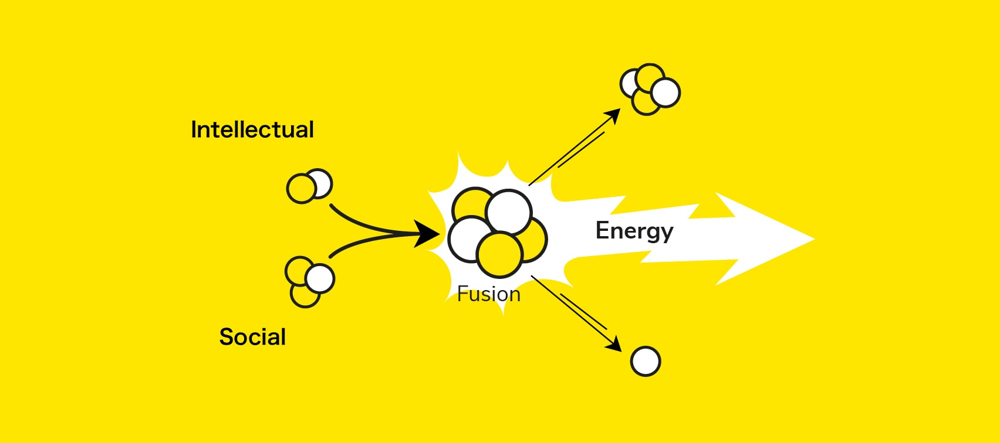

I'm not saying that pair programming or team coding is better. I'm a solo coder.

I'm not saying that group language learning is better. I do most of my language studies completely alone.

What I mean is that when these pursuits are used to connect with people, they become exponentially more valuable and enjoyable.

I've thought a lot about how [John Carmack says](https://www.youtube.com/watch?v=xzPuGf89vpI&ab_channel=LexClips) that the best programmers are the ones that build things that add value to people's lives. I've also thought about [Francis Bellard](https://bellard.org/). The guy is a genius coder, but maybe what makes his so special is that he uses this geniues to create things like [FFmpeg](https://ffmpeg.org/). It's hard to imagine the amount of value that piece of software brings to the world.

Coding is fun, just for its own sake. But there's something magical that happens when you create code that touches other people's lives. It's one thing to craft an algorithm that finds a solution to some problem. It's another thing to get that out into the world, and let people use it. There's a sort of incredible combustion that happens when you work out some solution or create some thing that also provides something enjoyable and useful for other people. It's not just a private intellectual exercise, but a way of interacting with other people's lives and thoughts.

Language learning is cool, but talking with people and connecting with people is what makes it magical. For most, this is what motivates them to spend the years it takes to get fluent. For many, there is some joy in sitting alone and understanding how a piece of grammar works in a language. But there's something so much greater and sweeter that happens when you can use that knowledge to communicate with someone, and be part of a conversation.

I think connecting with people makes things like language learning and coding really life-giving. It creates something like **a nuclear fusion of intellectual and social pursuits**, releasing massive amounts of energy.

_Picture adapted from [Orano](https://www.orano.group/en/unpacking-nuclear/nuclear-fission-and-nuclear-fusion-what-you-should-know)_

Even people who sit alone creating made up languages (conlangs) that only they can understand love to share their creations with others. If they make it big, they get an incredible rush from seeing their language used by actors in film and TV. Solo coders who carefully craft niche libraries get a sense of satisfaction when they hear people are actually using them. What about people who create algorithms or mathematical concepts that seemingly have no immediate practical application? Those pioneers may look forward in faith, thinking that if they've discovered something real and beautiful, [it might be used and appreciated somewhere, somehow](https://adueck.github.io/blog/on-haskell-jazz-and-pure-math/).
