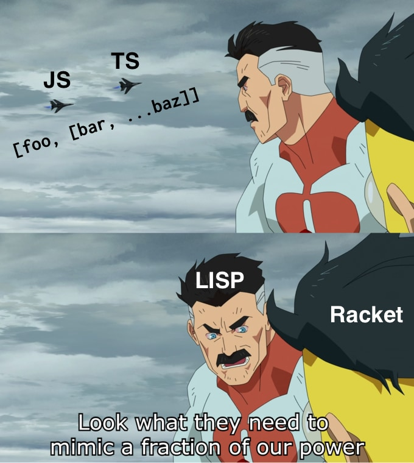
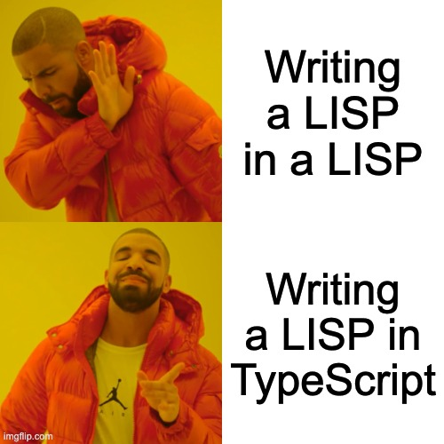

In this post I'm going to talk about how I figured out I could **use nested array destructuring in TypeScript** to work **like S-Expression macros** in LISP/Racket. Why?

> "Programming resembles poetry. Like poets, programmers practice their skill on seemingly pointless ideas." - [HTDP](https://htdp.org/2023-3-6/Book/part_four.html#%28part._ch~3apoetry-sexp%29)

These days I've been learning more about parsers, interperters, and creating languages. I've been working through [Programming Languages: Application and Interpretation](https://www.plai.org) or [PLAI](https://www.plai.org), which does a great job of taking you through the process of building a LISP like language interpreter in Racket.

**Sure writing a LISP in a LISP is cool but have you ever tried writing a LISP in a [LISP in C's clothing](https://www.oreilly.com/library/view/javascript-the-good/9780596517748/) with an snazzy type system layered on top??**



I decided to follow along and see if I could make a similar language and interpreter **in TypeScript instead**. That way I could easily make a React app with [an interactive environment](https://adueck.github.io/plaiscript) that I could use to play with the language. I thought I'd call it...

## [PLAIScript](https://adueck.github.io/plaiscript) !

I wrote a [tokenizer](https://github.com/adueck/plaiscript/blob/main/src/language/tokenizer.ts) and [parser](https://github.com/adueck/plaiscript/blob/main/src/language/parser.ts) to turn the text into recursive arrays of expressions (something like S-Expressions) using in TypeScript. 

I made some types to represent the S-Expression data:

```ts
type SExpr = Atom | SExpr[];

type Atom = boolean | Identifier | Str | number;
type Identifier = string;
type Str = { s: string };
```

...and then a parser that would take text like this:

```text
(+ 2 3)
(define (myF x) (* x 2))
(define name "foo")
```

...and turn it into arrays like this in TypeScript:

```ts
[
    ["+" 2 3],
    ["define", ["myF" "x"], ["*", "x" 2]],
    ["define", "name", { s: "foo" }],
]
```

Now we can process these lists of data just like we would with a LISP-style interpreter, but in TypeScript.

Starting with very simply expressions like `(+ 2 3)` or `(+ 3 (+ 1 2))`, the book gives us an example of a simple interpreter like this in Racket.

```racket
(define (interp e)
    (type-case Exp e
        [(num n) n]
        [(plus l r) (+ (interp l) (interp r))]))
```

We can write the same thing in TypeScript like this:

```ts
type SExpr = Atom | SExpr[];
type Atom = number | "+";

function interp(e: SExpr): number {
    if (typeof e === "number") {
        return e;
    }
    if (Array.isArray(e) && e[0] === "+") {
        return interp(e[1]) + interp(e[2]);
    }
    throw new Error("invalid expression");
}
// input: 3
console.log(interp(3));
// 3

// input: (+ 1 (+ 3 2))
console.log(interp(["+", 1, ["+", 3, 2]]));
// 6
```

And then we can expand our little interpreter bit by bit, to add other features like variable definitions and lookup...

The book gives us a growing interpreter function like this:

```racket
(define (interp e nv)
    (type-case Exp e
        [(numE n) n]
        [(varE s) (lookup s nv)]
        [(plusE l r) (+ (interp l nv) (interp r nv))]
        [(minusE l r) (- (interp l nv) (interp r nv))]
        [(let1E var val body)
            (let ([new-env (extend nv
                                   var
                                   (interp val nv))])
                (interp body new-env))]))
```

Pattern matching doesn't work quite as nicely in TypeScript as it does in the Racket example, and our parser is only spitting out plain S-Expressions, not specially typed expressions as the book does, but with a little work we can do something similar with [type narrowing](https://www.typescriptlang.org/docs/handbook/2/narrowing.html).

```typescript
type SExpr = Atom | SExpr[];
type Atom = number | Identifier;
type Identifier = string;
type Env = Record<string, number>;

function interp(e: SExpr, nv: Env): number {
    if (typeof e === "number") {
        return e;
    }
    if (typeof e === "string") {
        return nv[e];
    }
    if (e[0] === "+") {
        return interp(e[1], nv) + interp(e[2], nv);
    }
    if (e[0] === "-") {
        return interp(e[1], nv) + interp(e[2], nv);
    }
    if (e[0] === "let" && Array.isArray(e[1]) && e[2] !== undefined) {
        const ident = e[1][0] as Identifier;
        const val = e[1][1];
        const body = e[2];
        const newEnv: Env = {
            ...structuredClone(nv),
            [ident]: interp(val, nv),
        };
        return interp(body, newEnv);
    }
    throw new Error("invalid expression");
}

// input: (let (x 10) (+ 4 x))
console.log(
    interp(
        ["let", ["x", 10], ["+", 4, "x"]],
        {},
    )
);
// 14
```

It's a bit rougher, but if we keep going we're able to build a [full fledged interpreter](https://github.com/adueck/plaiscript/blob/main/src/language/interpreter.ts), all in TypeScript, with functions, arbitrary number of parameters, etc.

## But what about macros? In TypeScript??

PLAI talks about how we can extend the language by "desugaring" certain features by rewriting them into other code using basic features in the language. To do this, it uses [macros](https://docs.racket-lang.org/guide/macros.html) in Racket.

Macros in Racket take certain S-Expressions and transform them into other forms of S-Expressions before they are interpreted. The power of macros in LISP-like languages lies in the fact that all the expressions are just lists of data, so it's very simple to edit and re-arrange. 

In our TypeScript implementation we also have our expressions as **arrays of data**, so we can **try to edit and re-arrange them** in a similar way as Racket macros would.

Interestingly enough, we can use **nested destructuring** of arrays in TypeScript to grab all the different sections of the S-Expression, and then re-write them into a new array of expressions. It's not quite like macros in Racket, but we can see how we can use it in the same way for our purposes in TypeScript. 

PLAI first shows us an example of how we can make a simple macro that takes allows us to build stricter version of the basic `if` statement:

```Racket
(define-syntax strict-if
  (syntax-rules ()
    [(strict-if C T E)
     (if (boolean? C)
         (if C T E)
         (error 'strict-if "expected a boolean"))]))
```

Given an S-Expression of the form:

```Racket
(strict-if C T E)
```

The macro re-writes the expression into something that checks if the condition is a boolean first:

```Racket
(if (boolean? C)
    (if C T E)
    (error 'strict-if "expected a boolean"))]))
```

Now we can do the same thing with array destructuring assignment in TypeScript:

```ts
function strictIfMacro(se: SExpr): SExpr {
    // 1. Label the structure of the existing expression,
    // assigning the parts to variable names
    // C - condition, T - then clause, E - else clause
    // (strict-if C T E)
    const [strictIfI, C, T, E] = se;

    // 2. Take the parts we labelled and rewrite them into
    // a new expression
    // (if (boolean? C)
    //     (if C T E)
    //     (error 'strict-if "expected a boolean"))]))
    return ["if",
            ["boolean?", C],
            ["if", C, T, E],
            ["error", { s: "expected a boolean for strictIf" }]];
}
```

Again, we don't have the nice pattern matching we have in the Racket macros, but we can still use some uglier checks in typescript to check the structure of the expression that we are trying to transform in out wanna-be macro function:

```ts
function strictIfMacro(se: SExpr): SExpr {
    // Step 1: Pattern match the expression
    if (!Array.isArray(se)) {
        throw new Error("strict-if macro requires an array of expressions");
    }
    if (sl[0] !== "strict-if") {
        throw new Error("invalid macro label");
    }
    if (sl.length !== 4) {
        throw new Error("strictly-if requires 3 arguments");
    }
    // Step 2: assign labels to the parts of the expression
    const [strictIfI, C, T, E] = se;
    // Step 3: rewrite the expression
    return ["if",
            ["boolean?", C],
            ["if", C, T, E],
            ["error", { s: "expected a boolean for strictIf" }]];
}
```

It's all going to be uglier, we can do the same thing to imitate more complex macros with pattern matching and recursion.

Let's say we wanted to make a macro to create `and` statements using existing parts of the language `not` and `false?`:

In Racket we could make the macro like this:

```racket
(define-syntax my-and
  (syntax-rules ()
    [(my-and) #true]
    [(my-and a) a]
    [(my-and a b ...) (if (not (false? a))
                          (and b ...)
                          #false)]))
```

Now let's try and do the same thing in TypeScript...

```ts
function andMacro(se: SExpr): SExpr {
    if (!Array.isArray(se)) {
        throw new Error("and macro requires an array of expressions");
    }
    if (se[0] !== "and") {
        throw new Error("invalid macro");
    }
    const [andI, a, b, ...rest] = se;
    // [(my-and) #true]
    if (a === undefined) {
        return true;
    }
    // [(my-and a) a]
    if (b === undefined) {
        return a;
    }
    //     [(my-and a b ...) (if (not (false? a))
    //                           (and b ...)
    //                           #false)]))
    return ["if", ["not", ["false?", a]],
                  ["and", b, ...rest],
                  false];
}
```

### Nested destructuring for more macro power!

But that's not all. We can also reach down and label nested S-Expression structures using *nested destructuring in JS/TS*.

For my language I wanted to create a Racket-like shorthand for defining functions with `define`.

Racket allows you to write the equivalent of this function definition...

```racket
(define my-add (lambda (x y) (+ x y)))
```

...as:

```racket
(define (my-add x y) (+ x y))
```

We can mimic this behavior in our language implementation by making a macro that will take an expression like this:

```ts
["define", ["my-add", "x", "y"], ["+", "x", "y"]]
```

And re-write it to an expression like this:

```ts
["define", "my-add" ["lambda", ["x", "y"], ["+", "x", "y"]]]
```

The nested destructuring of arrays in TypeScript allows us to reach down and label different sections of the expressions.

```ts
export function funMacro(sl: SExpr[]): SExpr {
    /* istanbul ignore next */
    if (sl[0] !== "define") {
        throw new Error("invalid macro");
    }
    if (!Array.isArray(sl[1]) || !(typeof sl[1][0] === "string" || (typeof sl[1][0] === "object" && "name" in sl[1][0]))) {
        throw new Error("invalid define function syntax");
    }
    if (sl[2] === undefined) {
        throw new Error("body missing in function definition");
    }
    // (define (funName arg ...) body)
    const [defineI, [funName, ...args], body] = sl;
    // (define funName (lambda (arg ...) body))
    return ["define",
              funName,
              ["lambda", args, body]];
}
```

It certainly is cool to see the power of a programming language paradigm where the code is data, and can be moved around and manipulated as such. I think it's a beautiful idea. It's also been fun trying to mimic the powers of this approach using another powerful and beautiful idea, nested destructuring in JS/TS.

See [my PLAIScript project](https://adueck.github.io/plaiscript) here.


