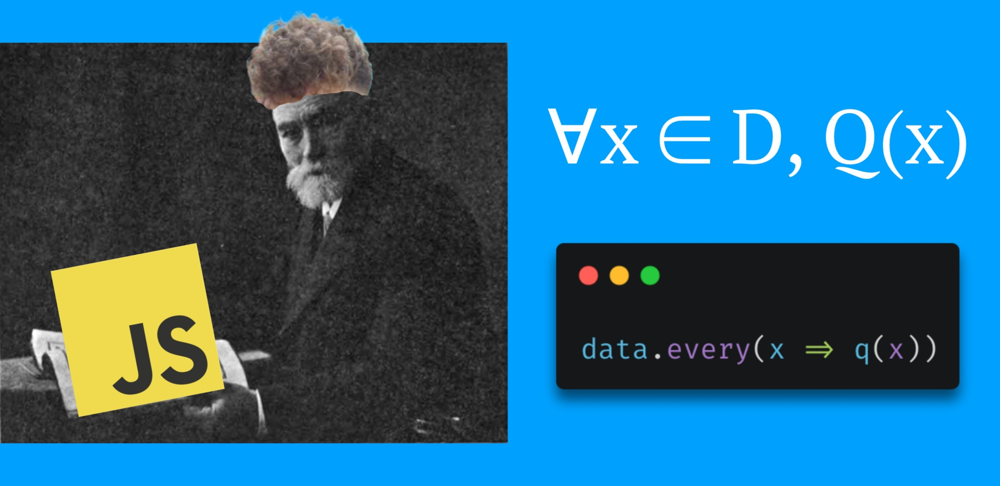
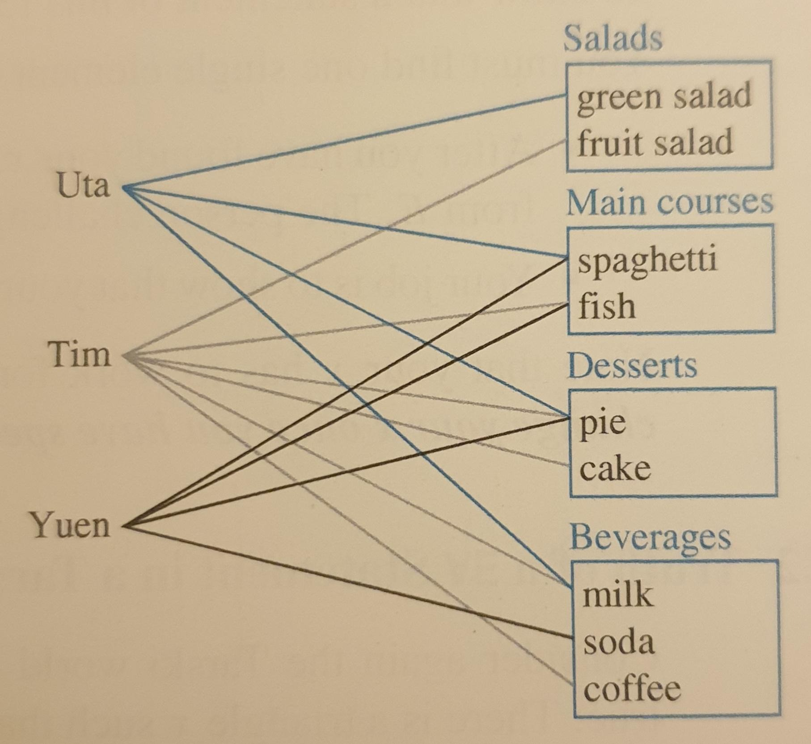
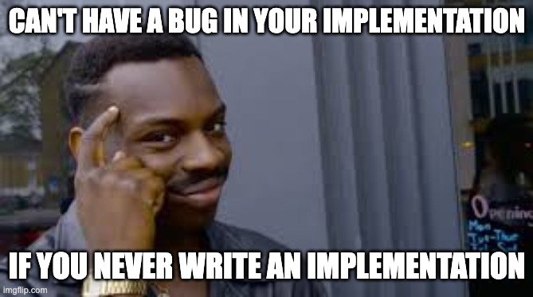

As I've been learning programming I've found it's drawn me back into math, and I am really enjoying seeing the parallels between the formal logic of mathematics and the logic we see in code.

I've been enjoying working through Sussana S. Epp's fantastic [Discrete Mathematics with Applications](https://www.amazon.com/Discrete-Mathematics-Applications-Susanna-Epp/dp/0495391328) and I am seeing how a lot of the mathematical concepts I'm learning were things that I had already seen or played with in functional programming, using Scheme/Racket and JavaScript/TypeScript.

## Quantified Statements in JavaScript

For example, quantified statements using $\exists$ and $\forall$ can be expressed using JavaScript's [`Array.some`](https://developer.mozilla.org/en-US/docs/Web/JavaScript/Reference/Global_Objects/Array/some) and [`Array.every`](https://developer.mozilla.org/en-US/docs/Web/JavaScript/Reference/Global_Objects/Array/every) methods.

- `Array.some` works just like the **existential quantifier $\bold{\exists}$**.
    - Given an array of data it tells you if the predicate function is **true for at least one of the elements**.
- `Array.every` works just like the **universal quantifier $\bold{\forall}$**.
    - Given an array of data it tells you if the predicate function is **true for all of the elements**.

Both of these methods work on an array of data and take a predicate function as an argument. `Array.some` checks to see if the predicate is true for any one of the elements in the array. `Array.every` checks to see if the predicate is true for all of the elements in the array.

Let's try translating some mathematical quantified statements into JavaScript:


```js
// let greaterThan10(n) be the predicate n > 10
function greaterThan10(n) {
    return n > 10;
}

// let greaterThan10(n) be the predicate n > 20
function greaterThan20(n) {
    return n > 20;
}

// let myNums = {21, 12, 30, 70}
const myNums = [21, 12, 30, 70];

// ∀n ∈ myNums, greaterThan10(n)
// "every number in myNums is greater than 10"
myNums.every(greaterThan10);
// true

// ∃n ∈ myNums such that greaterThan20(n)
// "there is a number in myNums that is greater than 20" 
myNums.some(greaterThan20);
// true

// ∀n ∈ myNums, greaterThan20(n)
// "every number in myNums is greater than 20"
myNums.every(greaterThan20);
// false
```

We can also use anonymous arrow functions to express the same thing like this:

```js
// ∀n ∈ {21, 12, 30, 70}, n > 10
[21, 12, 30, 70].every(n => n > 10);
// true

// ∃n ∈ {21, 12, 30, 70} such that n > 20
[21, 12, 30, 70].some(n => n > 20);
// true

data.every(x => q(x))
```

## Negation of Quantified Statements in JavaScript

We can also apply the same rules of logic we learn for quantified statements to these JavaScript abstractions.

We know that the negation of

$$
\forall x\in D, Q(x)
$$

is the same (logically equivalent) as

$$
\exists x\in D~\text{such that}~\neg Q(x)
$$

In other words, the opposite of saying, "Q(x) is true for every single element in D" would be to say, "There is at least one element in D for which Q(x) is not true." Formally,

$$
\neg (\forall x \in D, Q(x)) \equiv \exists x \in D~\text{such that}~\neg Q(x)
$$

So in JavaScript using `Array.every` and `Array.some` we should be able to do the negation the same way.

```js
!data.all(x => q(x));
// is logically equivalent to
data.some(x => !q(x));
```

Sure enough, it works. Whatever you have for `data`, these two lines will produce the same result.

The same thing works for negation the other way.

$$
\neg (\exists x \in D~\text{such that}~Q(x)) \equiv \forall x \in D, \neg (x)
$$

```js
!data.some(x => q(x));
// is logically equivalent to
data.all(x => !q(x));
```

## Vacuous truth of universal statements or why `Array.all` is true by default

What happens if you ask if something is true for "all" of an empty set of data?

```js
[].all(n => n > 10);
// TRUE
```

Just like we learn in discrete math, these kinds of statements are true by default unless their negation is true. We remember from above that the negation of is:

```js
// The negation of [].all(n => n > 10) is:
![].all(n => n > 10);
// or, equivalently
[].some(n => n <= 10);
```

We cannot say that there are "some" elements of the empty set that are less than or equal to 10. So we have to say that "all" elements of the empty set are greater than 10.

If you run these methods on empty arrays:

- `Array.some` will be `false` by default (just like $\exists$)
- `Array.all` will be `true` by default (just like $\forall$)

## Multiply-Quantified Statements in JavaScript

We can also combine these abstractions to express multiply-quantified statements in JavaScript. These are useful for asking complex, real-life questions about data. 

In [Discrete Mathematics with Applications](https://www.amazon.com/Discrete-Mathematics-Applications-Susanna-Epp/dp/0495391328) example 3.3.3 we find an example problem with some data on students and what they chose at the cafeteria. The data is given in a chart as follows:



We can express this data in JavaScript like this:

```js
const stations = [
    { name: "salads", items: ["greed salad", "fruit salad"] },
    { name: "main courses", items: ["spaghetti", "fish"] },
    { name: "desserts", items: ["pie", "cake"] },
    { name: "beverages", items: ["milk", "soda", "coffee"] },
];

const students = [
    { name: "Uta", choices: ["green salad", "spaghetti", "pie", "milk"] },
    { name: "Tim", choices: ["fruit salad", "fish", "pie", "cake", "milk", "coffee"] },
    { name: "Yuen", choices: ["spaghetti", "fish", "pie", "soda"] },
];

const items = stations.reduce((accum, station) => (
    [...accum, ...station.items]
), []);
```

Given this data, the book asks the student to check if a number of multiply-quantified statements are true or not. Let's have a look at each of the statements and translate them to JavaScript. Then instead of going through the data manually and seeing if the statement is true or not, the interpreter will evaluate it for us.

> a. $\exists$ an item $I$ such that $\forall$ students $S$, $S$ chose $I$.

In other words, there is an item that was chosen by all the students.

```js
// ∃ an item i such that
items.some(i =>
    // ∀ students s
    students.every(s =>
        // s chose i
        s.choices.includes(i)
    )
);
// true
// (every student chose pie)
```

> b. $\exists$ a student $S$ such that $\forall$ items $I$, $S$ chose $I$.

In other words, there is a student that chose every item.

```js
// ∃ a student s such that
students.some(s =>
    // ∀ items i
    items.every(i =>
        // s chose i
        s.choices.includes(i)
    )
);
// false
// (no one chose all the items)
```

> c. $\exists$ a student $S$ such that $\forall$ stations $Z$, $\exists$ an item $I$ in $Z$ such that $S$ chose $I$.

In other words, there is a student that chose an item from every station.

```js
// ∃ a student s such that
student.some(s =>
    // ∀ stations z,
    stations.every(z =>
        // ∃ an item i in z such that
        z.items.some(i =>
            // s chose i
            s.choices.includes(i)
        )
    )
);
// true
// (both Tim and Uta chose an item from every station)
```

> d. $\forall$ students $S$ and $\forall$ stations $Z$, $\exists$ an item $I$ in $Z$ such that $S$ chose $I$.

In other words, every student chose something from every station.

```js
// ∀ students s and
student.every(s =>
    // ∀ stations z,
    stations.every(z =>
        // ∃ an item i in z such that
        z.items.some(i =>
            // s chose i
            s.choices.includes(i)
        )
    )
);
// false
// (Yuen didn't choose a salad)
```

## Using quantified statements for clear, easy, bug-free code

Without a computer, we would have to manually go through all the data and see if the statements were true or not. If we had a computer and were writing in an imperative style, we could use a bunch of loops and variables to go through all the data and check if the statements are true or not. But with these functional abstractions in javascript **we can write these mathematical statements just as they are (declaritavely), and trust the interpreter to tell us whether they are true or not**.


This can be useful whenever we need to ask questions about data in real-world programs. These abstractions in JavaScript allow us to write statements in a declarative, mathematical way, and we can leave all the evaluation and implementation to the interpreter. This makes it easier and clearer to write and modify. It also avoids any bugs that might creep into our own evaluations or implementations.



To demonstrate how much easier this is let's try translating the simplest statement into imperative javascript, and compare it to our declarative, math-like translation we used above.

```js
// ∃ an item I such that ∀ students S, S chose I
// there is an item that was chosen by all the students

// IMPERATIVE VERSION 😩
let oneItemWasChosenByAll = false;
for (let i of items) {
    let itemChosenByAll = true;
    for (let s of students) {
        let studentChoseItem = false;
        for (let c of s.choices) {
        if (c === i) {
            studentChoseItem = true;
            break;
        }
        }
        if (!studentChoseItem) {
            itemChosenByAll = false;
            break;
        }
    }
    if (itemChosenByAll) {
        oneItemWasChosenByAll = true;
        break;
    }
}
oneItemWasChosenByAll;
// true

// DECLARATIVE VERSION 😎
items.some(i => 
    students.every(s =>
        s.choices.includes(i)
    )
);
// true
```

Yikes, that imperative version is a lot harder to write, a lot harder to understand, and a lot more prone to bugs.

It's nice to see these functional elements of the language can be used to write code that is rock-solid, logically sound, and backed by fundamental mathematical principles.
