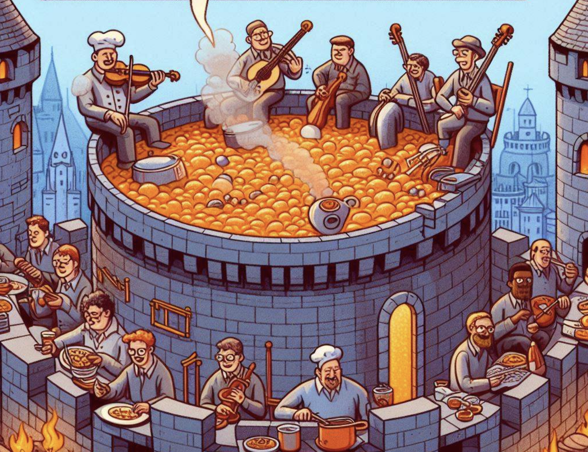
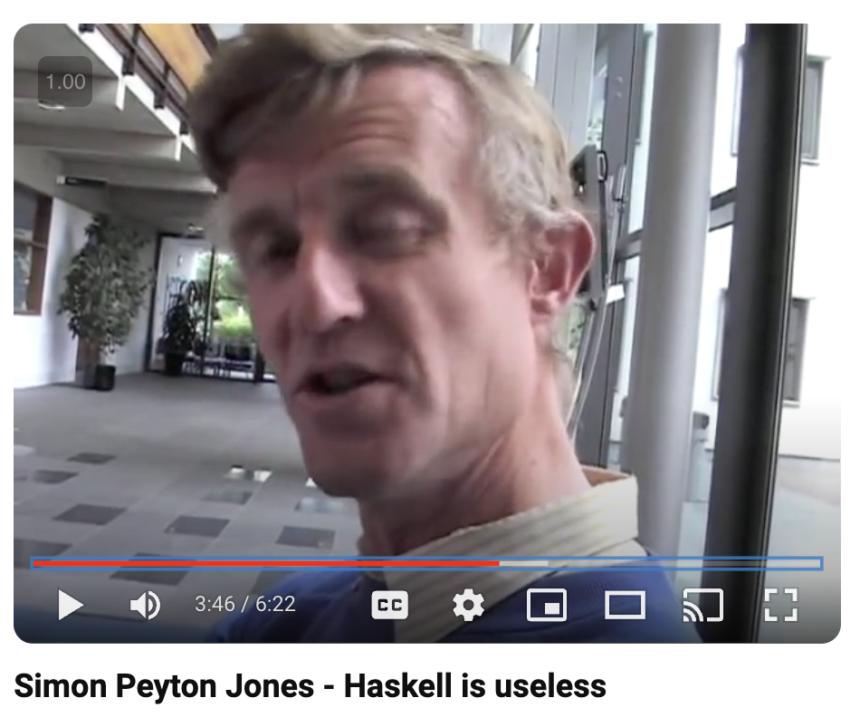

All three of these things get a lot of hate for being elitist, obscure, irrelevant, painful, and useless. But are they?

They all have a huge barrier to entry. Beacause they are so “hard” only a few people persevere enough to really “get into” them. See [coding in haskell until I rage quit](https://www.youtube.com/watch?v=dNi__BckudQ) for a funny example of this. What’s the point in torturing ourselves trying to learn these things or getting lost in these rabbit-holes inhabited by arrogant elites?

These endeavors are often considered a waste of time. Their practicioners seem to be divorced from the real world. They don’t actually produce anything useful. Rather than working on practical things that everyone can enjoy, they seem to be caught up in silly exercises just to show off to other nerds.

Haskell and functional programmers write needlessly intricate code exercises [just to publish papers](https://www.youtube.com/watch?v=dNi__BckudQ), they say. Jazz musicians play weird music that nobody listens to. They practice endlessly just to impress other musicians with their tricks. Pure mathmeticians devote their life to insane puzzles that have no relevance to anything remotely useful.

> "Imperative programming is literally fuelling the world. I would even say that imperative programming is the only kind of programming that exists. Everything else is just _toys for academics to play with_." Tsoding [on the Superiority of Imperative Programming](https://youtu.be/V-o1cKaWOQc?si=IUNFOpuY7YG_SGfK&t=3205)

Haskell is just ‘code for coders’. Jazz is just ‘music for musicians.’ Pure math is just ‘math for mathematicians.’ It’s all a useless cyclical exercise that doesn’t bring any value to the real world.

But no, this is not the case.

These are all playgrounds for great ideas. And many of these ideas end up bringing unthinkable huge value to everyone.

The things cooked up in these useless, theoretical spheres trickle down into the mainstream over time. The seemingly pointless and useless exercises end up bearing enormously useful, practical fruit.

There was a time when higher order functions like `map` seemed esoteric, only understandable or useful to a small circle of Lisp nerds. Nowadays every 16-year-old web-dev reaches for `Array.map(x => 
{x}
)` when they write their pages in the most popular framework. These formerly esoteric higher-order functions have now become part of the “hello world” of every React tutorial. They’ve become simple, easy to understand, and they make everyone’s lives much exponentially easier.

People used to scoff at strong static typing and algebraic data types. “Why would we [waste our time with these type constraints](https://blog.cleancoder.com/uncle-bob/2016/05/01/TypeWars.html)?” they said. Now almost everyone is enjoying the life-changing benefits of strong typing and ADTs as they jump on the TypeScript bandwagon.

Some of the sounds that people experiment with in the most avant-garde music become often used and well loved in mare popular music. Added 9th chords and stacked fifths are now ubiquitous in mainstream pop music. [Tritone substitutions](https://jazz-library.com/articles/tritone-substitution) are a based on a sort of mathematical theory trick cooked up in classical and jazz music. Now they are commonplace in popular R&B, soul, and gospel music. These little snippets of grating harmonies might have seemed strange, artificial and inaccessible at a time. But they end up becoming like a common spice that gives everyone the stank face or make them smile with delight.

What a hundred years ago was seemed like the most extreme mental acrobatics of a few crazy mathmeticians has become elementary and entry level in practical engineering courses. It turns out these mathematical techniques can be used to explain things in the real world and make everyday products we all use and enjoy. 

Haskell programmers and CS academics play around with the possibilities of how things can be computed. Jazz musicians play around with sound and the feelings that different scales, harmonies and rythms can give us. Pure mathmeticians play around with imaginary objects and abstractions to find structure and patterns.

They can all push the limits in these areas beacause they’re not constrained by being practical, popular, or useful. And in this process, they do discover extremely powerful, beautiful things.

In his classic book [An Introduction to Mathematics](https://www.gutenberg.org/ebooks/41568), Alfred North Whitehead argues with all kinds of fascinating examples that those who pursued theoretical ideas for their own sake end up making far more practical advances than those stuck to the practical, immediately useful stuff.

Whitehead explains how Machael Faraday discovered the laws of induction between currents and magnets back in 1831-32. *"What is the use of this discovery?"* someone asked. *"What's the use of child--it grows to be a man,"* he responded. To quote Whitehead, "Faraday's child has grown to be a man and is now the basis of all the modern applications of electricity."

Today practically minded programmers may ask, "What's the use of monads?" "What's the point of experimenting with dependent types in Agda?"

If everyone was stuck coding popular apps in the most popular languages, our mainstream programming languages would suck much more. Our apps would be buggier and a lot harder to make. 

If everyone was just playing the most popular music out there that everyone wanted to hear, we wouldn’t get some of the sweet harmonies and rhythms in popular music that tickle the average ear and move hearts.

If everyone was stuck doing “useful math” to solve everyday problems, we wouldn’t have had some of the great discoveries that have allowed us to understand and create useful new things.

So let’s not hate the Haskell programmers, jazz musicians, and pure mathmeticians. Let’s show them some love and be thankful for the great stuff that they’re busy cooking up.

And don’t be afraid to venture into these “highbrow” spheres and explore. It may seem useless and painful at first. It may seem like a waste of time. But try setting aside the need for everything to be “practical” and “useful.” Enjoy whatever you can in the playgrounds of ideas. Who knows what you might discover, and what massive practical value you might get from it.

