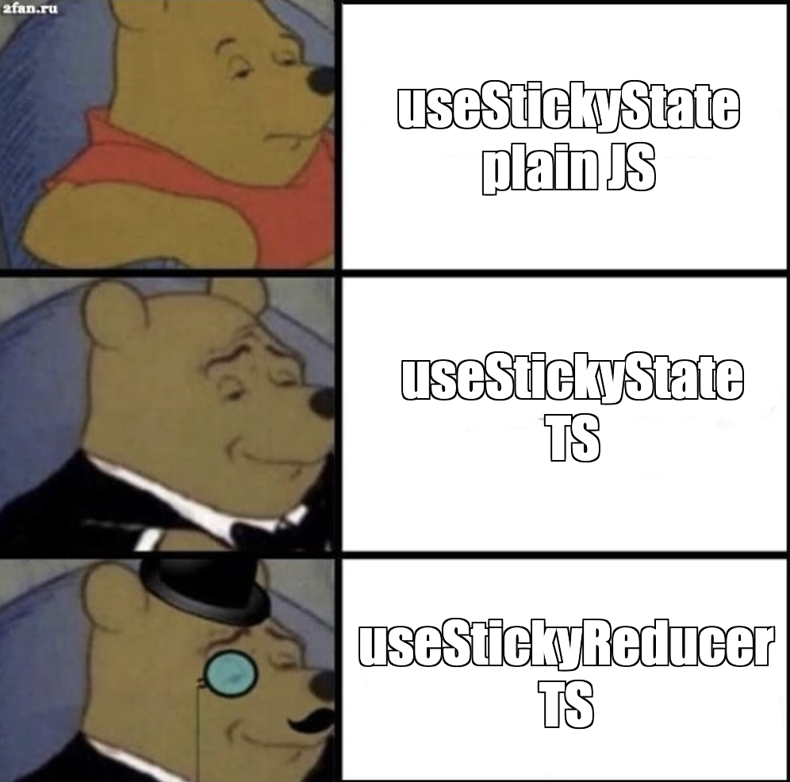

There are a number of [libraries](https://www.npmjs.com/package/use-sticky-state) and [tutorials](https://www.joshwcomeau.com/snippets/react-hooks/use-sticky-state/) available that explain how to make `useState` keep the state saved in localStorage when a user revisits or reloads the page.

In this post I'd like to explore how we can take things a bit further with TypeScript, generics, first-order functions and the `useReducer` pattern. This will give us **more power, flexibility, and safety** in how we persist our state.

<div style={{ maxWidth: "500px", margin: "0 auto" }}>

</div>

## Baby steps: Using plain, untyped JavaScript

First of all, let's have a look at a **plain JS** `useStickyState` pattern that we can find a number of examples of:

```js
// useStickyState.js

import { useState } from "react";

export default …function useStickyState(defaultValue, key) {
  const [value, setValue] = useState(() => {
    // get the value that might be saved in localStorage
    const v = localStorage.getItem(key);
    // if there was nothing saved then initialize it with the default value
    if (v === null) {
        return defaultValue;
    }
    // otherwise try to parse the value saved
    // and initialize the state with that value
    try {
        return JSON.parse(v);
    } catch (e) {
        // in case that fails or there was bad data saved in the given key
        // fall back to the default value
        console.error("error parsing saved state from useStickyState");
        return defaultValue;
    }
  });

  useEffect(() => {
    // whenever the value is updated, save the value to localStorage
    localStorage.setItem(key, JSON.stringify(value));
  }, [key, value]);

  return [value, setValue];
}
```

Now we can use this `useStickyState` hook in place of `useState` and have our state persist automatically across page visits.

```jsx
// App.jsx

import useStickyState from "./useStickyState";

export default function App() {
    const [count, setCount] = useStickyState(0, "my-key");
    function incrementCount() {
        setCount(c => c + 1);
    }
    return <>
        <div>Count: {count}</div>
        <button onClick={incrementCount}>Increment</button>
    </>;
}
```

Now when the page is reloaded, `useStickyState` will first look for the count that was saved in localStorage and the user can pick up where they left off.

## Using TypeScript and generics for type-safe, persistent state

Now let's write that basic `useStickyState` pattern **in TypeScript** so that we can have type-safe state. (Because friends don't let friends use untyped JavaScript.)

This is a perfect case for **[generics](https://www.typescriptlang.org/docs/handbook/2/generics.html)**. This way we can have a `useState` pattern that is strongly typed with whatever data type we're using it for.

```ts
// useStickyState.tsx

import { useState, useEffect, Dispatch, SetStateAction } from "react";

type SaveableData = string | number | object | boolean | undefined | null;

export default function useStickyState<T extends SaveableData>(defaultValue: T, key: string): [
  value: T,
  setValue: Dispatch<SetStateAction<T>>,
] {
  const [value, setValue] = useState(() => {
    const v = localStorage.getItem(key);
    if (v === null) {
        return defaultValue;
    }
    try {
      return JSON.parse(v);
    } catch (e) {
      console.error("error parsing saved state from useStickyState");
      return defaultValue;
    }
  });

  useEffect(() => {
    localStorage.setItem(key, JSON.stringify(value));
  }, [key, value]);

  return [value, setValue];
}
```

The user can initialize `useStickyState` with any type, as long as it fits within the wider `SaveableData` type, that is, as long as it's something that can be saved as a string in localStorage.

```tsx
// App.tsx

import useStickyState from "./useStickyState";

export default function App() {
    const [count, setCount] = useStickyState<number>(0, "my-key");
    function incrementCount() {
        // this for instance, would throw a type error
        // setCount(c => `${c}+1`);
        //
        // but this is allowed
        setCount(c => c + 1);
    }
    return <>
        <div>Count: {count}</div>
        <button onClick={incrementCount}>Increment</button>
    </>;
}
```

## Using first-order functions for advanced state setup

Initializing state with some starting value is cool, but what if we could **initialize it with some piece of logic** that would take whatever we have saved and do something to it at the start. Thankfully in TypeScript/JavaScript, functions are data (first-order functions), so we can do this by passing a function as a value to our `useStickyState` hook.

```ts
// useStickyState.ts

import { useState, useEffect, Dispatch, SetStateAction } from "react";

type SaveableData = string | number | object | boolean | undefined | null;

export default function useStickyState<T extends SaveableData>(
  defaultValue: T,
  key: string,
  initialization?: (savedValue: T) => T,
): [
  value: T,
  setValue: Dispatch<SetStateAction<T>>,
] {
  const [value, setValue] = useState(() => {
    const v = localStorage.getItem(key);
    if (v === null) {
      return defaultValue;
    }
    
    try {
      // if we have an initialization function, apply that to the
      // value we retrieved from localStorage
      const saved = JSON.parse(v) as T;
      return initialization ? initialization(saved) : saved;
    } catch (e) {
      console.error("error parsing saved state from useStickyState");
      return defaultValue;
    }
  });

  useEffect(() => {
    localStorage.setItem(key, JSON.stringify(value));
  }, [key, value]);

  return [value, setValue];
}
```

Now we could do something like this, where the saved counter is knocked down two numbers every time the page is loaded.

```tsx
// App.tsx

import useStickyState from "./useStickyState";

export default function App() {
    const [count, setCount] = useStickyState<number>(
      0,
      "my-key",
      // our function to modify the saved starting state
      (saved: number) => saved - 2,
    );
    function incrementCount() {
        setCount(c => c + 1);
    }
    return <>
        <div>Count: {count}</div>
        <button onClick={incrementCount}>Increment</button>
    </>;
}
```

Before you laugh at how that could ever be necessary, I promise you I found a very good use case for this using some complex saved state that needed to be modified whenever a component appeared.

## Using `useStickyState` to make a `useStickyReducer` hook 🧐

We've got a nice, typed way of storing persistent state, but what if we don't be all will-nilly transformations like savages? The [useReducer](https://beta.reactjs.org/reference/react/useReducer) hook provides a great way of using a [reducer pattern](https://kentcdodds.com/blog/the-state-reducer-pattern-with-react-hooks) for extra safe and clear state transformations. Basically the reducer pattern, we are constrained to:

- define a number of actions that we can do to the state
- create a `reducer` function that will take the state and output a new state based on the allowed actions
- any changes to the state have to be done by these "accepted" actions, through the reducer.

**We can think of the reducer as a sort of guard or a manager for the state**. 💂‍♀️ We can't walk up and touch the state and do whatever we want with it. We have to ask the reducer to do one of the pre-defined, approved actions to the state. 📋

We can easily build a sticky, persistent version of `useReducer` using what we have so far.

```tsx
// useStickyReducer.tsx

import useStickyState from './useStickyState';

// takes a generic type for the type of state: T
// as well as a generic for the type of action: A

export function useStickyReducer<T extends SaveableData, A>(
  reducer: (state: T, dispatch: A) => T,
  defaultValue: T,
  key: string,
  initializer: (saved: T) => T
): [T, (action: A) => void] {
  // use a useStickState hook internally
  const [state, unsafeSetState] = useStickyState<T>(
    defaultValue,
    key,
    initializer
  );
  // but wrap any calls to adjust the state in a function that takes
  // an action and calls the reducer function with that action to
  // modify the state
  function adjustState(action: A) {
    unsafeSetState((oldState) => {
      const newState = reducer(oldState, action);
      return newState;
    });
  }
  // don't return the unsafeSetState function
  // only return the function that accepts a reducer action
  return [state, adjustState];
}
```

The code above might make more sense when we see how the hook is used in our app.

```tsx
// App.tsx

import { useStickyReducer } from './useStickyReducer';

// these are the actions for modifying the state that are allowed
type Action = 'increment' | 'double' | 'reset';

// this is a function that takes the state and handles a given Action
// giving us a new state
function reducer(state: number, dispatch: Action): number {
  if (dispatch === 'increment') {
    return state + 1;
  }
  if (dispatch === 'double') {
    return state * 2;
  }
  if (dispatch === 'reset') {
    return 0;
  }
}

export default function App() {
  const [count, dispatch] = useStickyReducer<number, Action>(
    reducer,
    0,
    'my-key',
    (saved: number) => saved - 2
  );
  return (
    <div>
      <div>Count: {count}</div>
      <button onClick={() => dispatch('increment')}>Increment</button>
      <button onClick={() => dispatch('double')}>Double</button>
      <button onClick={() => dispatch('reset')}>Reset</button>
    </div>
  );
}
```

### Making it safe to use with SSR

The last thing we might want to do is make these hooks safe to use in SSR, because a lot of frameworks use that these days and if we end up having these functions in our code as is it will break our build. To avoid these build errors we just need put checks around the references to `localStorage`, which will be `undefined` in a SSR environment.

```ts
// useStickyState.ts

import { useState, useEffect, Dispatch, SetStateAction } from "react";

type SaveableData = string | number | object | boolean | undefined | null;

export default function useStickyState<T extends SaveableData>(
  defaultValue: T,
  key: string,
  initialization?: (savedValue: T) => T,
): [
  value: T,
  setValue: Dispatch<SetStateAction<T>>,
] {
  const [value, setValue] = useState(() => {
    const v = typeof localStorage === "object" ? localStorage.getItem(key) : null;
    if (v === null) {
      return defaultValue;
    }
    
    try {
      const saved = JSON.parse(v) as T;
      return initialization ? initialization(saved) : saved;
    } catch (e) {
      console.error("error parsing saved state from useStickyState");
      return defaultValue;
    }
  });

  useEffect(() => {
    if (typeof localStorage === "object") {
      localStorage.setItem(key, JSON.stringify(value));
    }
  }, [key, value]);

  return [value, setValue];
}
```

If we end up using this code on a SSR component, *the loading from persisted state won't work* and it will behave like a regular `useState` hook, but at least it won't break any builds.

### Live Sandbox Demo

Here's a demo of all the code working together:

<div className="wide-element">
<iframe src="https://stackblitz.com/edit/react-ts-dzrpbu?embed=1&file=App.tsx"
    style={{ width: "100%", height: "650px", border: 0, borderRadius: "4px", overflow: "hidden" }}
    title="jsx-text-transformation"
    sandbox="allow-forms allow-modals allow-popups allow-presentation allow-same-origin allow-scripts"
></iframe>
</div>


