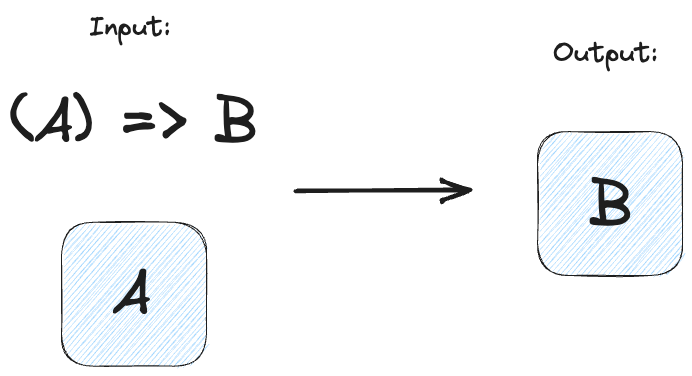
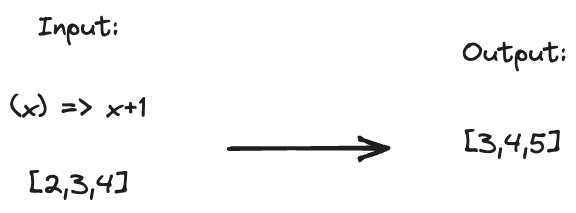
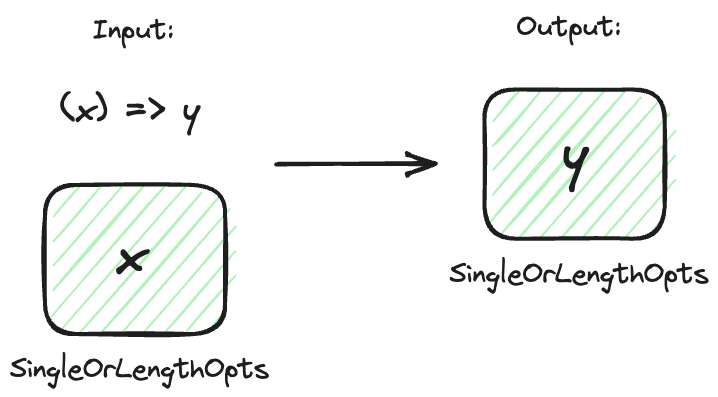
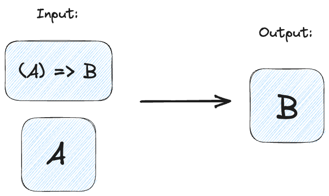

As I have been learning about functional programming, I've been delighted to see how these seemingly abstract FP contepts can be used to smooth over real-life pain points that I was running into in my code base. As I was understanding what monoids, functors, and monads actually were, I also started to see how they could be used to instantly and safely melt away huge chunks of repetitive and confusing code.

Sometimes people struggle to see how these "esoteric" ideas from functional programming could possibly be useful outside of the typical examples that we often see in tutorials:

- A monoid for string concatenation? Just use `+`
- A functor for mapping over arrays? That's just `Array.map()`
- A monad for error handling, IO, or async? Come on bro... don't overcomplicate things...

But when we really try to understand these concepts and use these concepts in different settings, we find that we have some very powerful tools that can serve us in many more ways than just mapping over arrays, or handling errors. 

Let me explain how I've used some functional programming concepts while building [pashto-inflector](https://github.com/lingdocs/pashto-inflector) in TypeScript, a library for working with Pashto text, parsing, and phrase generation. Hopefully these use-cases will help you grok the FP concepts, and give you ideas for how you might want to use them as well.

## Monoid

A monoid is a type of values that is defined by two things:

1. a **binary operation** (something that puts two values together like adding two numbers, joining two strings), and
2. an **identity element** (something "empty" that doesn't change the value), so that you can put any number of them together.

### The classic examples

With numbers:

- the **binary operation** is adding ( $$x + y$$ )
- the **identity element** is 0

Once we know these things, we can add together any number of numbers.

```ts
function sum(numbers: number[]): number {
  return numbers.reduce(
    (acc, n) => (
      // binary operation
      acc + n,
      // identity element
      0
    )
  );
}

console.log(sum([2,4,1]))
// 7
```

or we could do the same thing with strings:

- the **binary operation** is string concatenation
- the **identity element** is an empty string `""`

```ts
function concatAll(strings: string[]): string {
  return strings.reduce(
    (acc, s) => (
      // binary operation
      acc + s,
      // identity element
      ""
    )
  );
}

console.log(concatAll(["fp", "is", "cool"]))
// "fpiscool"
```

### My special use case

In my [pashto-inflector](https://github.com/lingdocs/pashto-inflector) library I have a special data structure that I use to represent Pashto text along with latin phonetics. Instead of a plain string of text I have an object that holds both the standard Pashto text, as well as the phonetics in latin letters which contain more information.

```ts
type PsString = {
  \** Pashto text *\
  p: string,
  \** Latin phonetics *\
  f: string,
}
```

Now when I want to join a bunch of these special text units together, I can't just use the `+` operator in TypeScript. I need to define a new function that will join these pieces of text together.

```ts
function concatPsString(a: PsString, b: PsString): PsString {
  return {
    p: a.p + b.p,
    f: a.f + b.f,
  };
}
```

We've got a **binary operation**, and so we're half-way to defining a monad here... we just need the **identity element**. What can we always add to the `PsString` without changing it?

```ts
const psStringIdElem: PsString = {
  p: "",
  f: "",
} 
```

Now we can make a similar function that will allow us to concat an arbitrary amount of PsStrings

```ts
function concatAllPsStrings(ps: PsString[]): PsString {
  return ps.reduce(
    (acc, s) => (
      // binary operation
      concatPsString(acc, s),
      // identity element
      { p: "", f: "" }
    )
  );
}

console.log(concatAllPsString([
  { p: "کور", f: "kor" }, { p: "ونه", f: "óona" },
]))
// { p: "کورنه", f: "koróona" }
```

Look familiar? In all these examples, we're doing the same basic operation. These abstractions allow us to express more and more complicated actions on more complex data structures using the exact same, simple pattern.

Before I knew what I monoid was I wrote a much more convulated, recursive function to try to join these `PsString`s together.

If we use the [fp-ts](https://github.com/gcanti/fp-ts) library, we can get the concat function of a monoid for free, just by defining the **binary operation** and the **identity element**

```ts
const monoidPsString: Monoid<PsString> = {
  // binary operation
  concat: concatPsSting,
  // identity element
  empty: { p: "", f: "" },
};
```

So if you know how to put two items together, and you know what an "empty" item is, you automatically know how to put as many items together as you want!

```ts
import { concatAll } from "fp-ts/lib/Monoid";

console.log(monoidPsString(concatAll)([
  { p: "لوست", f: "lwast" }, { p: "ل", f: "ul" }, { p: "ه", f: "a" },
]))
// { p: "لوستله", f: "lwastula" }
```

## Functor

A functor is a pattern that let's us apply some function to values inside a data structure, without changing the structure.



With a functor we can take a function that operates on a value, and a value in a container. Then with a bunch of FP magic, the function will rip the value out of the container, transform it, and shove it back into the container.

### Classic example

One of the classic examples of a functor is applying (mapping) a function to each element in an array



The function is applied to the data inside of the "container" (in this case an array), giving us back the same kind of container with the modified data.

We can implement an array functor in TypeScript like so:

```ts
function fmapArray<A, B>(f: (a: A) => B, arr: A[]): B[] {
  const output: B[] = [];
  for (let x of arr) {
    output.push(f(x));
  }
  return output;
}

function add1(x: number): number {
  return x + 1;
}

console.log(fmapArray(add1, [2,3,4]))
// [3,4,5]
```

But in TypeScript we already have this as `Array.map`

```ts
console.log([2,3,4].map(add1))
// [3,4,5]
```

### My special use case

Earlier a mentioned my special `PsString` data type for representing Pashto strings and their latin phonetics letters. I also have another data type that I use to hold potential length variations (if they exist):

```ts
type SingleOrLengthOpts<A> = A | {
  long: A,
  short: A,
}
```

So if I have a variable of type `SingleOrLengthOpts<PsString>` this means that it could either be a plain `PsString`, or a long and short version of the PsString. Here are some examples:

```ts
const examples: SingleOrLengthOpts<PsString>[] = [
  { p: "نوم", f: "noom" },
  {
    long: { p: "لیک", f: "leek" },
    short: { p: "لیکل", f: "leekul" },
  },
];
```

This is nice, but when I was trying to work with this data type it got a bit tedious trying to check if there were length options or not, and then doing something to it:

```ts
function someFunction(x: SingleOrLengthOpts<PsString>): SingleOrLengthOpts<PsString> {
  // ...

  if ("long" in x) {
    return {
      long: doSomethingElse(x.long),
      short: doSomethingElse(x.short),
    };
  } else {
    return doSomethingElse(x),
  }
}
```

I found myself writing stuff like this over and over again! There must be some way I could automate all this annoying checking and handling the potential length options... 🤔

My weird `SingleOrLengthOpts` is a particular kind of data structure, or container. And functors let us **apply functions to data in containers** while preserving the container. Functors to the rescue! Yes, if I could define a functor for `SingleOrLengthOpts`, then I could just apply any function to the contents of `SingleOrLengthOpts`, and it would handle all the messy stuff for me!



```ts
export function fmapSingleOrLengthOpts<A, B>(
  f: (x: A) => B,
  x: T.SingleOrLengthOpts<A>
): T.SingleOrLengthOpts<B> {
  // if there are length options on the piece of data
  // apply the function to each length option
  if (x && typeof x === "object" && "long" in x) {
    return {
      long: f(x.long),
      short: f(x.short),
    };
  }
  // otherwise just apply the function to the plain data
  return f(x);
}
```

That little `fmap` function for `SingleOrLengthOpts` allows me to melt away all kinds of repetitive and annoying code.

```ts
function someFunction(x: SingleOrLengthOpts<PsString>): SingleOrLengthOpts<PsString> {
  // ...

  // GOODBYE repetitive junk 🗑️
  // if ("long" in x) {
  //   return {
  //     long: doSomethingElse(x.long),
  //     short: doSomethingElse(x.short),
  //   };
  // } else {
  //   return doSomethingElse(x),
  // }

  // HELLO functor ! ✨
  return fmapSingleOrLengthOpts(doSomethingElse, x);
}
```

This was quite helpful, and I cleaned up big chunks of repetitive, error prone code with this one-line abstraction. But I realized I *couldn't use it everywhere*... 

The problem was that sometimes I wanted to apply a *different* function depending on whether something was "long" or "short", but my clever functor just **blindly applied a function to the data inside the structure**. Whenever I wanted a different behaviour depending on the length, I had to go back to my old, tiresome way of manually checking and applying the function to all the lengths.

```ts
function someOtherFunction(x: SingleOrLengthOpts<PsString>): SingleOrLengthOpts<PsString> {
  // ...

  if ("long" in x) {
    return {
      long: doSomethingElse(x.long),
      short: doSomethingSpecial(x.short),
    };
  } else {
    return doSomethingElse(x),
  }
}
```

Could there be a nice FP abstraction that would let me clean up these bits of code? Why yes there is!

## Applicative Functor

An applicitive functor let's us apply a **function in a container** to some **data in a container**!



At first I struggled to imagine why I would ever want to do this. Why would I want to put a *function* in the same container as the data??

But here's the cool thing... Just like I could have a potential length options for my data, I could have potential length options for my function! So if I wanted to pass in a different function depending on the length of the data, I could do that!

So let's say I wanted to apply the function `doSomethingSpecial` whenever I encountered a *short* version of the text, but `doSomethingElse` in any other case. Instead of writing the old manual...

```ts
function someOtherFunction(x: SingleOrLengthOpts<PsString>): SingleOrLengthOpts<PsString> {
  // ...

  if ("long" in x) {
    return {
      long: doSomethingElse(x.long),
      short: doSomethingSpecial(x.short),
    };
  } else {
    return doSomethingElse(x),
  }
}
```

We could write something like this

```ts
  // ...
  return applicativeFunctorMagic(
    // function in a container!
    {
      long: doSomethingElse,
      short: doSomethingSpecial,
    },
    // data in a container
    x,
  );
```

All we need to do is write our one function for our applicative functor magic and define how we want to apply our container of function(s) to our container of data.

```ts
export function applySingleOrLengthOpts<A, B>(
  f: T.SingleOrLengthOpts<(a: A) => B>,
  a: T.SingleOrLengthOpts<A>
): T.SingleOrLengthOpts<B> {
  if (f && "long" in f) {
    // if there's a long / short version of the function
    // as well as a long / short version of the data
    // apply the appropriate version to the appropriate length
    if (a && typeof a === "object" && "long" in a) {
      return {
        long: fmapSingleOrLengthOpts(f.long, a.long) as B,
        short: fmapSingleOrLengthOpts(f.short, a.short) as B,
      };
    } else {
      // if there's no length options in the data
      // just apply the long version of the function by default
      return fmapSingleOrLengthOpts(f.long, a);
    }
  } else {
    // if it's just a plain function and plain data, apply the function to the data
    return fmapSingleOrLengthOpts(f, a);
  }
}
```

Once we have all these pieces, we can quickly and cleanly write powerful bits of code that before would take huge amounts of repetition and boilerplate. 

For example, let's say we have a bunch of stems of verbs here. Some are just a single length, and some have length variations:

```ts
const stems: SingleOrLengthOpts<PsString>[] = [
  {
    long: { p: "ګرزېږ", f: "gurzeG" },
    short: { p: "ګرز", f: "gurz" },
  },
  { p: "لیک", f: "leek" },
  { p: "وین", f: "ween" },
];
```

And then we wanted to add endings on all of them, but how we add the endings depends on whether we have a long or a short version of the text.

```ts
const withEndings = stems.map(s => applyEnding({
  long: addAccentedEnding,
  short: addUnAccentedEnding,
}, s));
```

And the applicitave functor will handle all the special checking and applying for all the different cases automatically!

If we were to curry the `applyEnding` function we can get something even nicer:

```ts
const withEndings = stems.map(applyEnding({
  long: addAccentedEnding,
  short: addUnAccentedEnding,
}));
```

## Monad

As for monads... I found a really sweet use case for them while working on the parser [pashto-inflector](https://github.com/lingdocs/pashto-inflector) as a way to handle the tokens and error messages being passed around between the parsing functions. But... that will be left for a topic for another day. 
