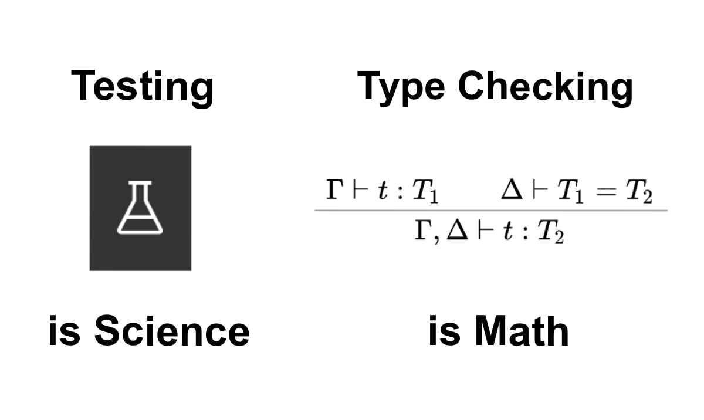
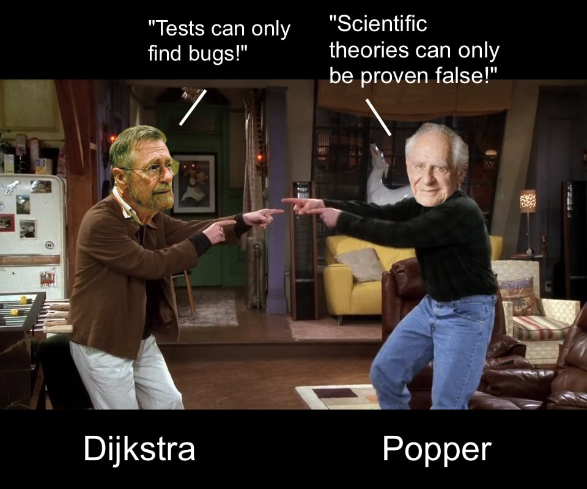
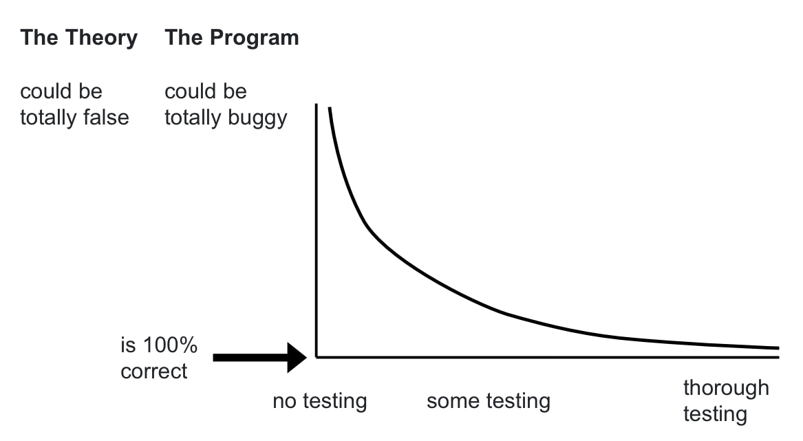
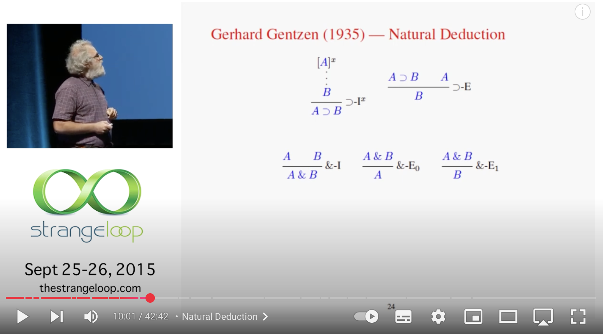

Testing software is like empirical science. You run experiments to see if there's something wrong with a theory or a program. Based on observations of certain behaviors you theorize that things are working correctly.

Type-checking software is like math. You use cold, hard deductive logic to say if something is true or not.

## Science uses tests

Edsger W. Dijkstra [famously said](https://www.goodreads.com/quotes/506689-program-testing-can-be-used-to-show-the-presence-of) that "Program testing can be used to show the presence of bugs, but never to show their absence!" Testing can show that a program is incorrect, but it cannot show that a program is correct. You can find bugs by testing, but you can't show that there are no bugs by testing. In any given piece of software there might be an infinite number of moving parts and factors. Who knows, there could be some cases that you haven't covered.

Karl Popper argued that scientific theories can never be proven, they can only be disproven. You find 'bugs' in any theory by doing experiments, testing it, and showing it to be false. You can't prove that a theory is true. You can work to make the theory a closer and closer approximation of truth, but you can never be sure that you have reached 100%, absolute truth. It's a messy world out there. How can you guarantee that the theory has been tested under every possible condition, with every possible set of factors?

<table>
  <thead>
    <tr>
      <th></th>
      <th>Software Development</th>
      <th>Empirical Science</th>
    </tr>
  </thead>
  <tbody>
    <tr>
      <td>uses</td>
      <td>tests</td>
      <td>experiments</td>
    </tr>
    <tr>
      <td>to find</td>
      <td>bugs</td>
      <td>when a theory is wrong</td>
    </tr>
  </tbody>
</table>

In both empirical science and software development then, the experiments or tests to show what's wrong with the theory or program. The more thorough your tests are, the more sure you can be that your program or theory is good. If Dijkstra and Popper are right, you can only **approach** correctness. You can get and infinitely _closer_ approximation of the truth, kind of like approaching a limit in calculus.

## Science Uses Inductive Reasoning

Empirical science uses **inductive reasoning**. If we take a sample of 100 people and no-one lives beyond 110, we can make a generalization and say that "people don't live past 110." If we do the same thing with ten million people, we can say this with more certainty. If someone lives longer, we know we need to adjust our age limit. We see a certain thing happening over and over again, and so we can try to assume there is some law behind it. We can adjust our laws when we see other cases that prove them wrong. It's not perfect, but it often works.

In the same way, software testing works to test hypotheses about how our software works. "If I type in this information, I will expect this response." You have a theory of how a program is supposed to work. You can test this by tring a bunch of different inputs, trying to see if at any point this theory is wrong. But as Dijkstra said, your tests can only show you when that theory is wrong. They cannot show you that that theory is correct.

Failing (or falsification) is the basic useful action that tests can do. It's the litmus test for a test being alive and working. Notice that in Test Driven Development the first step is to write a test that _fails_. First you write a test for something you know the program won't do, and then you watch it fail. That shows you that the test is really working, and it's really 'getting at' that problem. Then you adjust the program to be able to pass that test. At this point you know that you have changed something, and your theory about the program is a little bit stronger.

We can expand our test cases to make the testing more rigorous, and to be _more_ sure that our program is correct. We can even use [property-based testing](https://www.teach.cs.toronto.edu/~csc148h/notes/testing/hypothesis.html), where we essentially set up programs to be an army of scientists running a whole bunch of tests on our programs using random data. But we are always _approaching_ that point of 100% surety. Perhaps something else will break. Perhaps this or that browser will do something weird. End-to-end testing can cover more of these cases. But unless we have the most trivial example programs, can we ever cover every possible test case?

Testing software, like empirical science, can either fairly straightforward or very messy. Science tries to find order in the chaos of the everyday world. It tries to test what it can, and tries to make better and better theories of how things work. Sometimes, like with classical mechanics, we have an extremely good understanding of what is going on. But other times, when looking at quantam mechanics, there is a lot more magic and mystery. We have to try this or that and see what works. Sometimes we will have a very good handle on what a program is doing. We basically know exactly what it will do. Other times, we have almost no idea how some program is working.

I remember working on one particularly terrible mess of code I created. As I kept building this monstrosity I had less and less of a clue as to what was going on and why. Towards the end I was just changing random stuff and holding my breath, hoping to see the green checkmarks. Finally I was able to assemble comprehensive battery of 300 or so tests, and I breathed a great sigh of relief as I saw them all light up green. But then, months later, I still kept finding bugs.

## Math Uses Logic and Deductive Reasoning

We see that empirical science is often messy and uncertain. But pure math, in contrast, is clear and pristine. **Pure math lives is a world of pure logic and axioms**. Given a set of axioms, you can use hard, deductive logic to see determine if statements are true or not. Math has the privilege of operating in a world of absolute truth.

In [A Mathematician's Apology](https://en.wikipedia.org/wiki/A_Mathematician%27s_Apology) G.H. Hardy contrasts the work of physicists with the work of pure mathematicians. He boldly claims that "the mathematician is in much more direct contact with reality" than the physicist. He explains that physicists try to line up the fuzzy mess of reality they're faced with with some clear rules or relations. "A mathematician, on the other hand, is working with his own mathematical reality." (section 24) Scientists have to work with a approximations of an ideal. The have to try to make that fit with the messy behavior of things in the real world. Mathematicians work with an ideal world of truth and logic.

This mathematical world of pure logic and deduction also corresponds perfectly to the type checking we use in software development. See the talk [Propositions as Types](https://www.youtube.com/watch?v=IOiZatlZtGU) by Philip Wadler. Just like a logician can put together axioms and be assured of the truth or falsity of different algorithms, we can use type checking to see if the pieces of our program fit together correctly or not.

Incredibly, the perfect world of deductive reasoning also exactly mirrors the systems we use for type checking the programs we write. And herein lies the magic: we can steal from the mathematicians ideal world of pure logic and build real-world programs using these incredible axioms. It's a wonderful experience to be typing and have the type checker, in real time, show you when something is true or false. I can change one thing in a massive TypeScript project and instantly see the red lines appear where things break in other files. I can know that a program is correct not just because I've tested a whole bunch of different cases, but because I know that it does fit together logically.

Tests only work to test something that's been built. They can make sure an existing piece of software doesn't have (certain) errors. As soon as you change the building, you have to change the tests.

But type checking does something much more incredible. It allows us to build out endlessly, and ensures that _whatever we build_ our structure stays intact and safe. We can re-form something or add a big new addition, and if we stay within the confines of logic, we know that everything still all good. This allows for tremendous power in building and exploring things. The benefits are undeniable. It's no wonder that typed languages like TypeScript and Rust are gaining popularity.

Of course, this is only true if the type system is _sound_ and _complete_. The popular type systems mentioned above do NOT cover everything, and they are NOT fool-proof. Althought these type-systems will cover a lot of things in your code, you can still make errors and break things without being warned by the type system. But people are working on better, more complete systems, using dependant and linear types. With these sound, complete systems, people can be sure that the entire program is logically, 100% correct.

With these advanced type systems, you can do so much more than just make sure a certain variable is a `String` or an `Int`. You can make sure that the _entire_ algorithm is 100%, logically sound. Uncle Bob [was wrong to say](https://blog.cleancoder.com/uncle-bob/2017/01/13/TypesAndTests.html#:~:text=The%20correctness%20of%20your%20type%20model%20has%20no%20bearing%20on%20the%20correctness%20of%20the%20behavior%20you%20have%20specified.) that "The correctness of your type model has no bearing on the correctness of the behavior you have specified." With more advanced type systems, you can type the behavior as well.

It's wonderful to see how mainstream programming languages are benefitting more and more from type checking. It's great to see how we don't always need to rely on empirical testing, but can also build things out, knowing they are correct by automatic deduction and logic. But it is not always easy or feasible to have 100% sound, type-checked programs. Usually a lot of stuff we build isn't perfectly typed and proven. And so we still need to run a lot of tests to try to find the mistakes in what we're building.

### Testing does not replace type checking

I think it's foolish to say that testing can replace type checking. Would scientists ever say that experiments can replace the need for math and formulas? Of course not. Any good scientist would reach for as much math as he can to try to make sense of what is going on.
